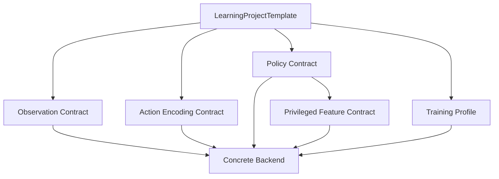
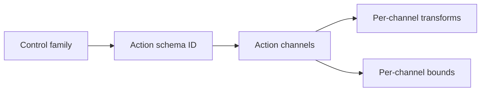
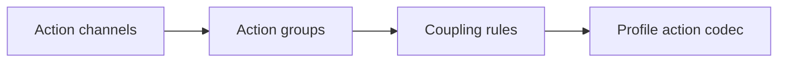

# Generic Training Contract Design

This design defines the backend-agnostic training contract after removing
incorrect quadrotor assumptions from generic validation. It intentionally does
not preserve compatibility with contracts that encoded one robot body as a
global action-encoding rule.

## Principle

`kuyu-training` owns typed training contracts. It does not own robot physics,
model internals, or MLX tensor execution.



The contract layer validates consistency, not physical meaning. Physical meaning
belongs to descriptor-backed profile components.

## Required Contract Split

| Contract | Generic responsibility | Must not contain |
|---|---|---|
| Observation | Schema identity, channel count, channel names/types, normalization, history requirements. | Robot-specific packing code. |
| Action | Schema identity, channel count, channel names, bounds, output transforms, unit metadata. | A global rule that one encoding implies one robot body. |
| Policy | Model architecture, action distribution, tensor dimensions, optimizer contracts. | Action channel semantics. |
| Privileged critic | Schema identity, ordered feature names, dimension, provider identity. | Hard-coded physical constants. |
| Training profile | Curriculum/acceptance/recovery profile IDs and profile-specific hyperparameters. | Backend implementation details. |

## Action Encoding Reset

The old enum-style `ctbr` meaning is too coarse: it combines a control family,
channel count, channel transforms, and reference quadrotor semantics. The reset
splits those concerns.



Target action contract:

| Field | Purpose |
|---|---|
| `schemaID` | Stable profile-owned action schema identity. |
| `family` | Broad control family such as continuous drive, joint target, vehicle command. |
| `channelCount` | Number of action channels. |
| `channels` | Ordered channel specs. |
| `transform` | Raw model output transform per channel. |
| `bounds` | Normalized and physical ranges when available. |
| `unit` | Optional physical unit metadata. |
| `groups` | Optional morphology/action hierarchy over channel indices. |
| `couplingRules` | Optional profile-owned coupling hints or constraints over groups/channels. |

Quadrotor CTBR becomes an action schema, not a generic model rule:

```text
schemaID: reference-quadrotor-ctbr-action-v1
family: continuousDrive
channels: collectiveThrust, bodyRateX, bodyRateY, bodyRateZ
```

Other robots may define action schemas with any valid channel count and
transforms without changing generic validation.

For large morphologies, the action contract can describe action structure without
making the generic model robot-specific:



The generic validator only checks structural integrity: group IDs are unique,
parent links are acyclic, group channel indices are in range and non-duplicated,
coupling rules reference existing groups or channels, and empty coupling scopes
are rejected. Physical interpretation belongs to the profile action codec.

## Validator Rules

The generic template validator should only enforce cross-contract consistency.

Allowed generic checks:

- Positive dimensions and channel counts.
- Policy action dimension equals action channel count.
- Policy observation dimension equals observation channel count.
- Privileged feature names count equals privileged dimension.
- Gaussian policy requires a stochastic training contract such as PPO.
- Action channel transforms and bounds are finite and internally consistent.
- Safety filter numeric parameters are finite and within their declared ranges.
- Required schema IDs are non-empty.
- Action groups and coupling rules are structurally valid.

Invalid generic checks:

- `ctbr` requires exactly four actions.
- `ctbr` requires `reference-quadrotor-body-rate-control-action-v1`.
- Safety filter fields assume thrust or body-rate names.
- Domain randomization field names imply mass, inertia, wind, or motor constants.

Those checks belong to the relevant profile validator.

## Profile Validator

Each executable profile may provide a validator that knows the robot body.
Built-in executable profiles must also declare a `TaskEvaluationProfileFamily`
so template validation can reject robot-class mismatches and evaluator ownership
leaks before a run is launched.


For quadrotor attitude training, the profile validator may require:

- A quadrotor CTBR action schema with four channels.
- A quadrotor observation schema.
- A privileged feature provider containing required mass/inertia/motor entries.
- Attitude task safety envelope and curriculum settings.

Those requirements must be expressed as profile requirements, not global rules.

For non-quadrotor profiles, the profile contract must own its evaluator IDs and
must not fall back to `ReferenceQuadrotorScenarioEvaluator` or
`ReferenceQuadrotorTaskQualityEvaluator`.

`ctbr` is a profile-owned action encoding. Template validation accepts it only
when the template root or runnable stage has an explicit reference-quadrotor
profile owner. Design-only blueprints without that owner must use neutral
observation/action contracts until a profile adapter exists.

## Type Direction

The enforced type direction is:

| Boundary | Owner |
|---|---|
| Tensor shape validation | `VectorizedTrainingBatchSpec`. |
| Observation/action/policy consistency | `LearningProjectContractValidator`. |
| Quadrotor contract presets | `ReferenceQuadrotorLearningContracts`. |
| RoArm M1 contract presets | `RoArmM1LearningContracts`. |
| Backend-executable training profile set | Backend profile registry, not generic contracts. |
| Domain randomization parameter names | Profile-owned policy factory or profile schema. |

The policy contract should be model-facing. The action contract should be
robot-facing. The template binds them.

## No Compatibility Rule

Do not keep deprecated factories or compatibility validation paths that preserve
the old CTBR shortcut. Old templates must be regenerated through profile
factories.

Preferred failure mode:

```text
compile error or template validation error
```

Rejected failure mode:

```text
old CTBR contract is silently accepted and interpreted as the new generic action contract
```

## Review Checklist

| Question | Required answer |
|---|---|
| Can the generic validator validate a non-quadrotor continuous action schema? | Yes |
| Does any generic validation error name a quadrotor-only concept? | No |
| Are profile-specific requirements implemented in profile validators? | Yes |
| Does the policy contract describe model shape without physical action meaning? | Yes |
| Does the action contract carry channel semantics and transforms? | Yes |
| Can an old CTBR shortcut survive unnoticed? | No |
