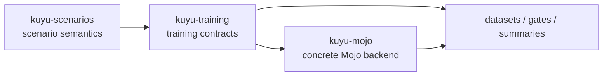
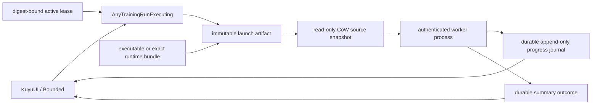
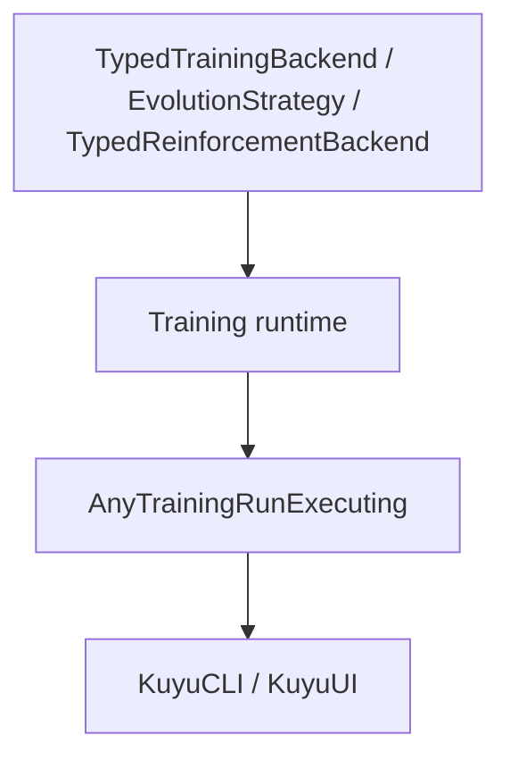

# kuyu-training

Generic training contracts and runtime infrastructure for the Kuyu simulation environment.

## Overview

kuyu-training owns backend-agnostic training contracts: project packages,
templates, rollout artifacts, GA/RL protocols, training plans, runtime
orchestration, and artifact validation. Concrete Manas Mojo execution and
checkpoint work belongs in `kuyu-mojo`.

The generic contract reset is defined in
`GENERIC_TRAINING_CONTRACT_DESIGN.md`. Generic validators must check contract
consistency only; robot-specific action, observation, privileged-feature, and
training-profile requirements belong to profile validators.

Package-local reliability milestones are defined in
`RELIABILITY_MILESTONES.md`. Implementation work should advance the first
incomplete milestone unless it is fixing a blocking defect in an earlier one.
Package-local reliability evidence is recorded in `RELIABILITY_EVIDENCE.md`.
The root individual reliability baseline is defined in
`../INDIVIDUAL_RELIABILITY_MILESTONES.md`; `kuyu-training` must remain
independently verifiable before downstream backend or app integration treats it
as stable.

The package responsibility skeleton is defined in
`../KUYU_PACKAGE_ARCHITECTURE.md`.

## Responsibility Boundary

`kuyu-training` consumes scenario semantics; it does not redefine them. Scenario
targets, safety/failure/truncation reasons, reward functions, and task-quality
meaning come from `kuyu-scenarios`. This package owns the training contract that
preserves those semantics in datasets, plans, orchestration, and validation
artifacts.



| Owned here | Consumed from `kuyu-scenarios` | Not owned here |
|---|---|---|
| Dataset schemas and writers | Scenario definitions and deterministic seeds | Reward formula authority |
| Rollout episode contracts and health gates | `RewardDescriptor` provenance | Target altitude/pose semantics |
| Training plans, templates, and runtime orchestration | Failure, truncation, and terminal reasons | PPO/Mojo kernels |
| Artifact validation and acceptance contracts | Task-quality evaluation results | Manas checkpoint internals |
| Generic observation/action/policy contracts | Profile-specific schema requirements | Robot-specific action semantics |

### Reliability Contract

- Persist scenario-owned terminal facts separately: `done`, `truncated`, and
  `terminalReason` must not be collapsed at the dataset metadata boundary.
- Persist `RewardDescriptor` with rollout datasets so cached training data can
  be invalidated when scenario reward semantics change.
- `continueValue` is a world-model sequence boundary signal, not a value
  bootstrap policy. RL loaders must use `done`, `truncated`, and
  `terminalReason` to decide whether bootstrapping is allowed.
- Generated artifact validation must reject empty compatibility requests,
  terminal manifests without completion time, completed runs without accepted
  convergence, and rejected/skipped/failed checkpoint decisions that expose an
  output checkpoint ID.
- Project-level evidence must be packaged and persisted through
  `TrainingProjectEvidencePack`, tying dataset lineage, curriculum stages,
  checkpoint decision state, regression artifact references, and scenario-owned
  stress-suite evidence, and physics descriptor-corpus acceptance evidence into
  one fail-closed contract for downstream consumers.
  Persisted packs must reload through `TrainingProjectEvidencePackArtifactStore`
  so referenced regression artifacts are root-relative and present, and
  referenced stress-suite manifests plus physics descriptor-corpus acceptance
  artifacts decode back to the saved evidence summaries, before adoption.
- Project-level evidence comparison must go through
  `TrainingProjectEvidencePackComparator`, so downstream consumers can decide
  whether a candidate pack improves over an incumbent without reinterpreting
  pack internals or robot-specific quality gates. Hardware-backed physics
  corpus evidence and Reference M2 benchmark coverage are first-class
  comparison factors, so otherwise equivalent candidates are promoted only
  when they carry stronger validated evidence summaries. Complete M2 coverage
  requires persisted `ReferenceM2BenchmarkEvidence`; dimension-only summaries
  are not promoted to complete M2 project evidence.
- Training code must consume typed scenario APIs for task references and gates;
  fallback target heights or reward constants must not be duplicated here.
- Backend-specific acceleration and checkpoint serialization belong in
  `kuyu-mojo`; this package exposes typed contracts and validation only.

### Process Worker Contract

Long-running training is executed outside the UI process. `kuyu-training` owns
the generic launch, supervision, stop, registration, and reconnection contract;
the concrete worker service and accelerated execution remain in `kuyu` and the
selected backend package.



| Boundary | Required behavior |
|---|---|
| Launch | The launcher creates a read-only copy-on-write `SOURCE_SNAPSHOT`, rewrites the immutable launch artifact to that snapshot, and verifies its digest. Before execution, the worker promotes or reuses the verified source under the destination artifact's `training-continuation/SOURCE_SNAPSHOT`, so resume does not depend on launch-cache retention. A standalone executable or containing app bundle preserves the existing byte-count and SHA-256 entrypoint checks. An explicit `TrainingRunWorkerExecutableSource` bundle preserves its relative executable layout, rejects overlapping launch/source roots and separately injected resources, hashes every file and directory entry, stages the exact tree read-only, and rechecks source plus staged identities. An injected `TrainingRunWorkerExecutableBundlePreflighting` verifier runs on both the source and staged bundle; only the staged result can proceed to spawn. |
| Identity | A registry PID is diagnostic only. A run attempt is identified by launch ID, attempt ID, launch digest, run ID, artifact root, and an exclusively held lease. The original launcher may signal only the unreaped child generation it directly owns; signal and `waitpid` operations are serialized by that process owner so PID reuse cannot redirect a signal. |
| Stop | Cancellation writes only `RUN_CONTROL/<launch>.<attempt>.stop`. The original parent may escalate after a bounded grace period; a reconnected observer fails closed when its cooperative-stop deadline expires. Once a terminal outcome is visible, stop timeout no longer applies and a separate bounded lease-quiescence deadline begins. |
| Progress | One persistent writer appends every event to ordered 16 MiB segments named `TRAINING_RUN_WORKER_PROGRESS/<launch>.<attempt>.<segment>.jsonl`. It holds an exclusive attempt lock, synchronizes each segment and the containing directory, rotates without imposing a total-run size cap, and validates sequence plus attempt identity on every read. Reconnection resumes from a `(segment, byteOffset)` cursor; only a torn tail in the final segment is repaired. A persistence failure cancels the run rather than allowing unobservable training. |
| Crash recovery | A new UI process reconnects through the active lease, replays unread durable progress in order, and waits for an attempt-bound terminal summary plus lease release. Missing outcomes from dead workers become failed tombstones; a worker that publishes an outcome but never releases its lease fails the bounded quiescence contract. |
| Detach | Closing a view stops observation without cancelling the training run. |
| Terminal state | Success or failure is adopted only from `TRAINING_RUN_WORKER_OUTCOMES/<launch>.<attempt>.json` after validating the complete attempt identity. Success requires a completed summary with an accepted checkpoint; the worker persists any contradictory completion as failure, and the launcher cross-checks terminal state against process exit status. |

### Protocol Skeleton

The training contract is intentionally split into generic internal protocols
and an app-facing type-erased facade.



| Protocol | Purpose |
|---|---|
| `TypedTrainingBackend` | Backend-specific checkpoint, candidate, observation, action, and fitness types |
| `EvolutionStrategy` | Selection and convergence policy over typed candidate evaluations |
| `TypedReinforcementBackend` | RL fine-tuning over typed rollout buffers |
| `AnyTrainingRunExecuting` | Stable UI/CLI entrypoint that hides backend associated types |
| `TrainingRunHandle` | Cancellable run handle with `Progress`, event stream, `wait()`, and `shutdown()` |

Existing evolution code is connected to the typed skeleton through adapters:

| Adapter | Direction |
|---|---|
| `EvolutionTypedBackendAdapter` | existing `EvolutionaryTrainingBackend` + `EvolutionCandidateEvaluating` -> `TypedTrainingBackend` |
| `TypedEvolutionLegacyBackendAdapter` | `TypedTrainingBackend` -> existing `EvolutionaryTrainingBackend` |
| `TypedEvolutionLegacyEvaluatorAdapter` | `TypedTrainingBackend` -> existing `EvolutionCandidateEvaluating` |
| `AnyCheckpointEvaluator` | concrete `CheckpointEvaluating` -> type-erased checkpoint evaluator |

This lets existing orchestrators keep running while Mojo backends implement
the generic typed protocols directly.

### Data Collection

- **`TrainingDatasetWriter`** — Writes per-step records (observations, actions, rewards) to structured dataset files.
- **`TrainingDatasetExporter`** — Exports complete datasets from scenario runs.
- **`ParallelDataCollector`** — Concurrent data collection across multiple scenarios.
- **`OnlineDataBuffer`** — Rolling buffer for online training data.

### Training Runtime

- **`AutomatedTrainingPipeline`** — Describes and validates the full training sequence: BC warm-start, swap adaptation, reflex HF stress, optional RL fine-tuning.
- **`CurriculumController`** — Manages progressive difficulty scheduling.
- **`AutoLabeler`** — Automatic labeling of rollouts with rewards and success criteria.
- **`EvolutionRunOrchestrator`** — Backend-agnostic evolutionary run orchestration over candidate genomes.
- **`TrainingRunOrchestrator`** — Backend-agnostic training run orchestration and checkpoint decision artifacts.
- **`TrainingRunDriver`** — Durable run-contract driver split into lifecycle, control, finish, checkpoint-digest, and identity boundaries so public run creation, resume, control polling, terminal outcome mapping, and accepted-checkpoint publication remain independently reviewable.
- **`GeneratedTrainingArtifactCompatibilityVerifier`** — Public facade for downstream consumers to load, validate, compare, and gate generated run, probe, checkpoint evaluation, evolution, project evidence, observability, and summary-outcome artifacts without depending on internal target layout. Its shell is split from request/report schemas, checkpoint-evaluation compatibility failures, aggregate verification, artifact loading, project-evidence comparison, evolution publication, and checkpoint-evaluation validation.
- **`GeneratedTrainingArtifactCompatibilityVerifier` project evidence support** — Downstream consumers can load validated project evidence packs, compare incumbent and candidate packs, and reject non-preferred candidates through the same public compatibility verifier used for run, probe, evolution, and checkpoint-evaluation artifacts.
- **`TrainingProjectEvidencePackValidator`** — Public project-level evidence pack builder/validator that checks dataset lineage, curriculum dependencies, checkpoint publication claims, regression artifact references, stress-suite evidence summaries, optional required reference M2 stress coverage, and physics descriptor-corpus evidence summaries including hardware-backed record counts and report hashes.
- **`TrainingProjectEvidencePackArtifactStore`** — Public writer/loader that persists project evidence packs and reloads them with referenced artifact existence checks plus referenced stress-suite manifest and physics descriptor-corpus consistency checks, including stale hardware-evidence summary rejection.
- **`TrainingProjectEvidencePackComparator`** — Public project-level evidence comparator that validates both packs, scores generic evidence state including reference M2 stress coverage, physics corpus coverage, hardware-backed physics evidence counts, and hardware report hash coverage, and reports a typed adoption decision plus dominant factor.
- **`TrainingDatasetCurationPolicyValidator`** — Public dataset-curation gate for raw dataset metadata and persisted project evidence packs; it checks coverage, record budgets, reward/provenance claims, and rejects raw-metadata-only requirements when only project evidence is available.

### Learning Project Templates

`LearningProjectTemplate` is the typed project format used by UI, CLI, and validators before a learning run starts.
It describes the robot class, descriptor reference, task, curriculum, observation/action contracts, checkpoint policy, compute profile, and evaluation gate without depending on a concrete numerical implementation.

```text
LearningProjectTemplate
├─ Identity
│  ├─ schemaVersion
│  ├─ templateID
│  ├─ displayName
│  └─ domain
├─ Robot / Task Contract
│  ├─ descriptor
│  ├─ task
│  ├─ taskProfileID
│  ├─ observation
│  └─ action
├─ Training Contract
│  ├─ modelBundlePolicy
│  ├─ trainingStrategy
│  ├─ curriculum
│  └─ compute
└─ Acceptance Contract
   └─ evaluationGate
```

Known Kuyu tasks such as `lift`, `singleLift`, and
`roArmM1ArmGripperTargetTracking` must match `TaskEvaluationProfile`.
Each profile declares its profile family, expected robot class, and evaluator
ownership so non-quadrotor profiles cannot silently inherit reference-quadrotor
evaluators. Future robot tasks can still be represented by the same format and
validated in non-strict mode until their task profile is added.
CTBR policies are not a generic fallback: they require an explicit
reference-quadrotor profile owner at the template root or runnable stage.
`LearningProjectTemplateValidator` keeps this boundary split across identity,
contract, profile-owner, curriculum, goal/evaluation, and runtime consistency
files, so generic template validation can grow without reabsorbing
reference-quadrotor policy semantics.
The reference-quadrotor rollout harness keeps policy factories, baseline policy
selection, rollout episode schemas, runner environment construction, limit
checks, episode projection, and parallel collection in focused files under
`ReferenceQuadrotorRuntime` so the profile adapter remains auditable.

Schema v6 rollout episodes persist typed `RolloutTransition` values:

```text
decision ID + O[k] + policy A[k]
                    |
                    v
          control-period physics
                    |
                    v
          applied U[k] + O[k+1]
```

`reinforcementRollout` and `worldModel` datasets require this causal contract.
`behaviorCloning` datasets instead require a same-time teacher label and cannot
be consumed as PPO rollout evidence. The validator rejects missing decision
identity, state/time discontinuity, action payload mismatch, and non-terminal
partial control periods. A final fail-fast or time-limit transition may be
shorter than the nominal control period.

Default project templates currently cover multi-stage robot training plans.
Executable stages may be narrower than the full curriculum while task profiles
and validators are added.

| Template ID | Domain | Task | Execution |
|-------------|--------|------|-----------|
| `aerial-drone-autonomy-starter-v1` | aerialDrone | `lift` first, then hover/navigation/recovery/regression | `runnableStarter` |
| `aerial-single-prop-lift-recovery-v1` | aerialDrone | `singleLift` | `runnableStarter` |
| `aerial-drone-hover-stabilization-v1` | aerialDrone | `hoverStabilization` | `designOnly` |
| `aerial-drone-waypoint-navigation-v1` | aerialDrone | `waypointNavigation` | `designOnly` |
| `ground-robot-point-navigation-v1` | groundRobot | `pointNavigation` | `designOnly` |
| `legged-robot-locomotion-v1` | groundRobot | `leggedLocomotion` | `designOnly` |
| `roarm-m1-arm-gripper-target-tracking-v1` | manipulator | `roArmM1ArmGripperTargetTracking` | `designOnly` |
| `manipulator-pick-and-place-v1` | manipulator | `pickAndPlace` | `designOnly` |
| `automotive-lane-keeping-v1` | automotive | `laneKeeping` | `designOnly` |

RoArm M1 has an executable Kuyu dataset-generation and Manas smoke-bundle
command, but it is not a `runnableStarter` project template until full campaign
orchestration can own the five-drive arm/gripper policy lifecycle.

### Dataset Types

- **`TrainingDatasetTypes`** — Shared types for dataset records, metadata, and formats.

## Package Structure

| Module | Dependencies | Description |
|--------|-------------|-------------|
| **KuyuTraining** | Split training targets | Facade-only public re-export target |
| **KuyuTrainingContracts** | Foundation | Stable project/run contracts, IDs, plans, capability enums, neutral DTOs, and Kuyu dataset v7 schemas |
| **KuyuEvolution** | KuyuTrainingContracts | Population, selection, mutation/crossover contracts, lineage, and evolution orchestration |
| **KuyuReinforcement** | KuyuTrainingContracts | RL backend protocols, rollout buffers, rollout health, stability envelopes, and vectorized rollout contracts |
| **KuyuTrainingValidation** | KuyuTrainingContracts, KuyuEvolution, KuyuReinforcement, KuyuCore, KuyuPhysics, KuyuScenarios | Dataset v7 validation/I/O and legacy diagnostics, artifact, project, template, scenario-output, checkpoint, convergence, profile validators, and profile-owned rollout/data adapters |
| **KuyuTrainingRuntime** | KuyuTrainingContracts, KuyuEvolution, KuyuReinforcement, KuyuTrainingValidation, KuyuCore, KuyuPhysics, KuyuScenarios | Run/probe orchestration, managed and process worker handles, authenticated launch/lease contracts, archive contracts, runtime tuple builders, generated artifact compatibility, and runtime compatibility extensions |

Target ownership:

| Target | Responsibility |
|---|---|
| `KuyuTrainingContracts` | Plans, profiles, model references, artifact schemas |
| `KuyuEvolution` | Population, selection, mutation/crossover contracts, lineage |
| `KuyuReinforcement` | RL backend protocols, rollout buffers, rollout health, stability envelopes, and profile-neutral vectorized rollout contracts |
| `KuyuTrainingRuntime` | Stage orchestration, cancellation/resume, process supervision/reconnection, resource scheduling |
| `KuyuTrainingValidation` | Artifact, project, template, and gate validators |

## Requirements

- Swift 6.2+
- macOS 26+

## Dependency Graph

```
KuyuCore
  |
  +-- KuyuPhysics
  |     |
  |     +-- KuyuScenarios
  |           |
  |           +-- KuyuTraining (this package)
  |                 |
  |                 +-- kuyu-mojo (implements Manas/Mojo backends)
  |                       |
  |                       +-- kuyu-app (CLI/UI adapters)
  |                             |
  |                             +-- Bounded (macOS document shell)
```

## License

See repository for license information.
