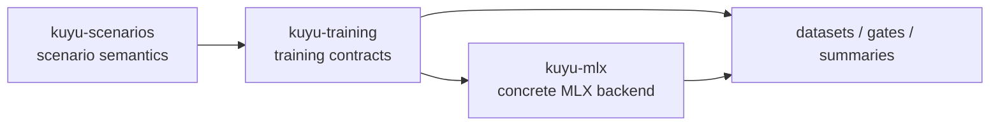
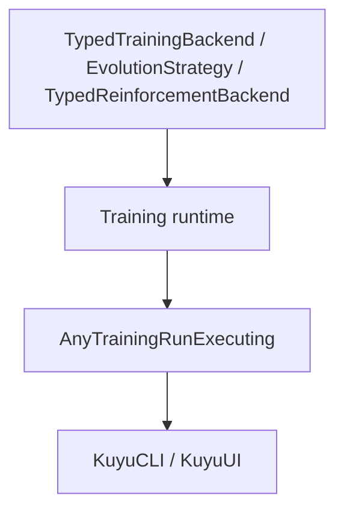

# kuyu-training

Generic training contracts and runtime infrastructure for the Kuyu simulation environment.

## Overview

kuyu-training owns backend-agnostic training contracts: project packages,
templates, rollout artifacts, GA/RL protocols, training plans, runtime
orchestration, and artifact validation. Concrete Manas/MLX checkpoint work
belongs in `kuyu-mlx`.

The generic contract reset is defined in
`GENERIC_TRAINING_CONTRACT_DESIGN.md`. Generic validators must check contract
consistency only; robot-specific action, observation, privileged-feature, and
training-profile requirements belong to profile validators.

Package-local reliability milestones are defined in
`RELIABILITY_MILESTONES.md`. Implementation work should advance the first
incomplete milestone unless it is fixing a blocking defect in an earlier one.
Package-local reliability evidence is recorded in `RELIABILITY_EVIDENCE.md`.
The root individual reliability baseline is defined in
`../INDIVIDUAL_RELIABILITY_MILESTONES.md`; `kuyu-training` must remain
independently verifiable before downstream backend or app integration treats it
as stable.

The package responsibility skeleton is defined in
`../KUYU_PACKAGE_ARCHITECTURE.md`.

## Responsibility Boundary

`kuyu-training` consumes scenario semantics; it does not redefine them. Scenario
targets, safety/failure/truncation reasons, reward functions, and task-quality
meaning come from `kuyu-scenarios`. This package owns the training contract that
preserves those semantics in datasets, plans, orchestration, and validation
artifacts.



| Owned here | Consumed from `kuyu-scenarios` | Not owned here |
|---|---|---|
| Dataset schemas and writers | Scenario definitions and deterministic seeds | Reward formula authority |
| Rollout episode contracts and health gates | `RewardDescriptor` provenance | Target altitude/pose semantics |
| Training plans, templates, and runtime orchestration | Failure, truncation, and terminal reasons | PPO/MLX kernels |
| Artifact validation and acceptance contracts | Task-quality evaluation results | Manas checkpoint internals |
| Generic observation/action/policy contracts | Profile-specific schema requirements | Robot-specific action semantics |

### Reliability Contract

- Persist scenario-owned terminal facts separately: `done`, `truncated`, and
  `terminalReason` must not be collapsed at the dataset metadata boundary.
- Persist `RewardDescriptor` with rollout datasets so cached training data can
  be invalidated when scenario reward semantics change.
- `continueValue` is a world-model sequence boundary signal, not a value
  bootstrap policy. RL loaders must use `done`, `truncated`, and
  `terminalReason` to decide whether bootstrapping is allowed.
- Generated artifact validation must reject empty compatibility requests,
  terminal manifests without completion time, completed runs without accepted
  convergence, and rejected/skipped/failed checkpoint decisions that expose an
  output checkpoint ID.
- Training code must consume typed scenario APIs for task references and gates;
  fallback target heights or reward constants must not be duplicated here.
- Backend-specific acceleration and checkpoint serialization belong in
  `kuyu-mlx`; this package should expose typed contracts and validation only.

### Protocol Skeleton

The training contract is intentionally split into generic internal protocols
and an app-facing type-erased facade.



| Protocol | Purpose |
|---|---|
| `TypedTrainingBackend` | Backend-specific checkpoint, candidate, observation, action, and fitness types |
| `EvolutionStrategy` | Selection and convergence policy over typed candidate evaluations |
| `TypedReinforcementBackend` | RL fine-tuning over typed rollout buffers |
| `AnyTrainingRunExecuting` | Stable UI/CLI entrypoint that hides backend associated types |
| `TrainingRunHandle` | Cancellable run handle with `Progress`, event stream, `wait()`, and `shutdown()` |

Existing evolution code is connected to the typed skeleton through adapters:

| Adapter | Direction |
|---|---|
| `EvolutionTypedBackendAdapter` | existing `EvolutionaryTrainingBackend` + `EvolutionCandidateEvaluating` -> `TypedTrainingBackend` |
| `TypedEvolutionLegacyBackendAdapter` | `TypedTrainingBackend` -> existing `EvolutionaryTrainingBackend` |
| `TypedEvolutionLegacyEvaluatorAdapter` | `TypedTrainingBackend` -> existing `EvolutionCandidateEvaluating` |
| `AnyCheckpointEvaluator` | concrete `CheckpointEvaluating` -> type-erased checkpoint evaluator |

This lets existing orchestrators keep running while new MLX backends implement
the generic typed protocols directly.

### Data Collection

- **`TrainingDatasetWriter`** — Writes per-step records (observations, actions, rewards) to structured dataset files.
- **`TrainingDatasetExporter`** — Exports complete datasets from scenario runs.
- **`ParallelDataCollector`** — Concurrent data collection across multiple scenarios.
- **`OnlineDataBuffer`** — Rolling buffer for online training data.

### Training Runtime

- **`AutomatedTrainingPipeline`** — Describes and validates the full training sequence: BC warm-start, swap adaptation, reflex HF stress, optional RL fine-tuning.
- **`CurriculumController`** — Manages progressive difficulty scheduling.
- **`AutoLabeler`** — Automatic labeling of rollouts with rewards and success criteria.
- **`EvolutionRunOrchestrator`** — Backend-agnostic evolutionary run orchestration over candidate genomes.
- **`TrainingRunOrchestrator`** — Backend-agnostic training run orchestration and checkpoint decision artifacts.
- **`GeneratedTrainingArtifactCompatibilityVerifier`** — Public facade for downstream consumers to load and validate generated run, probe, and checkpoint evaluation artifacts without depending on internal target layout.

### Learning Project Templates

`LearningProjectTemplate` is the typed project format used by UI, CLI, and validators before a learning run starts.
It describes the robot class, descriptor reference, task, curriculum, observation/action contracts, checkpoint policy, compute profile, and evaluation gate without depending on any concrete MLX implementation.

```text
LearningProjectTemplate
├─ Identity
│  ├─ schemaVersion
│  ├─ templateID
│  ├─ displayName
│  └─ domain
├─ Robot / Task Contract
│  ├─ descriptor
│  ├─ task
│  ├─ taskProfileID
│  ├─ observation
│  └─ action
├─ Training Contract
│  ├─ modelBundlePolicy
│  ├─ trainingStrategy
│  ├─ curriculum
│  └─ compute
└─ Acceptance Contract
   └─ evaluationGate
```

Known Kuyu tasks such as `lift`, `singleLift`, and
`roArmM1ArmGripperTargetTracking` must match `TaskEvaluationProfile`.
Each profile declares its profile family, expected robot class, and evaluator
ownership so non-quadrotor profiles cannot silently inherit reference-quadrotor
evaluators. Future robot tasks can still be represented by the same format and
validated in non-strict mode until their task profile is added.
CTBR policies are not a generic fallback: they require an explicit
reference-quadrotor profile owner at the template root or runnable stage.

Default project templates currently cover multi-stage robot training plans.
Executable stages may be narrower than the full curriculum while task profiles
and validators are added.

| Template ID | Domain | Task | Execution |
|-------------|--------|------|-----------|
| `aerial-drone-autonomy-starter-v1` | aerialDrone | `lift` first, then hover/navigation/recovery/regression | `runnableStarter` |
| `aerial-single-prop-lift-recovery-v1` | aerialDrone | `singleLift` | `runnableStarter` |
| `aerial-drone-hover-stabilization-v1` | aerialDrone | `hoverStabilization` | `designOnly` |
| `aerial-drone-waypoint-navigation-v1` | aerialDrone | `waypointNavigation` | `designOnly` |
| `ground-robot-point-navigation-v1` | groundRobot | `pointNavigation` | `designOnly` |
| `legged-robot-locomotion-v1` | groundRobot | `leggedLocomotion` | `designOnly` |
| `roarm-m1-arm-gripper-target-tracking-v1` | manipulator | `roArmM1ArmGripperTargetTracking` | `designOnly` |
| `manipulator-pick-and-place-v1` | manipulator | `pickAndPlace` | `designOnly` |
| `automotive-lane-keeping-v1` | automotive | `laneKeeping` | `designOnly` |

RoArm M1 has an executable Kuyu dataset-generation and Manas smoke-bundle
command, but it is not a `runnableStarter` project template until full campaign
orchestration can own the five-drive arm/gripper policy lifecycle.

### Dataset Types

- **`TrainingDatasetTypes`** — Shared types for dataset records, metadata, and formats.

## Package Structure

| Module | Dependencies | Description |
|--------|-------------|-------------|
| **KuyuTraining** | Split training targets | Facade-only public re-export target |
| **KuyuTrainingContracts** | Foundation | Stable project/run contracts, IDs, plans, capability enums, and neutral DTOs |
| **KuyuEvolution** | KuyuTrainingContracts | Population, selection, mutation/crossover contracts, lineage, and evolution orchestration |
| **KuyuReinforcement** | KuyuTrainingContracts | RL backend protocols, rollout buffers, rollout health, stability envelopes, and vectorized rollout contracts |
| **KuyuTrainingValidation** | KuyuTrainingContracts, KuyuEvolution, KuyuReinforcement, KuyuCore, KuyuPhysics, KuyuScenarios | Artifact, project, template, dataset, scenario-output, checkpoint, convergence, profile validators, and profile-owned rollout/data adapters |
| **KuyuTrainingRuntime** | KuyuTrainingContracts, KuyuEvolution, KuyuReinforcement, KuyuTrainingValidation, KuyuCore, KuyuPhysics, KuyuScenarios | Run/probe orchestration, managed handles, archive contracts, runtime tuple builders, generated artifact compatibility, and runtime compatibility extensions |

Target ownership:

| Target | Responsibility |
|---|---|
| `KuyuTrainingContracts` | Plans, profiles, model references, artifact schemas |
| `KuyuEvolution` | Population, selection, mutation/crossover contracts, lineage |
| `KuyuReinforcement` | RL backend protocols, rollout buffers, rollout health, stability envelopes, and profile-neutral vectorized rollout contracts |
| `KuyuTrainingRuntime` | Stage orchestration, cancellation/resume, resource scheduling |
| `KuyuTrainingValidation` | Artifact, project, template, and gate validators |

## Requirements

- Swift 6.2+
- macOS 26+

## Dependency Graph

```
KuyuCore
  |
  +-- KuyuPhysics
  |     |
  |     +-- KuyuScenarios
  |           |
  |           +-- KuyuTraining (this package)
  |                 |
  |                 +-- kuyu-mlx (implements Manas/MLX backends)
  |                       |
  |                       +-- kuyu-app (CLI/UI adapters)
  |                             |
  |                             +-- Bounded (macOS document shell)
```

## License

See repository for license information.
