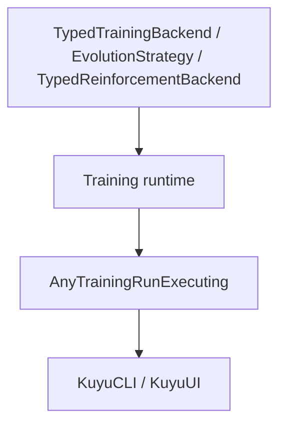

# kuyu-training

Generic training contracts and runtime infrastructure for the Kuyu simulation environment.

## Overview

kuyu-training owns backend-agnostic training contracts: project packages,
templates, rollout artifacts, GA/RL protocols, training plans, runtime
orchestration, and artifact validation. Concrete Manas/MLX checkpoint work
belongs in `kuyu-mlx`.

The package responsibility skeleton is defined in
`../KUYU_PACKAGE_ARCHITECTURE.md`.

### Protocol Skeleton

The training contract is intentionally split into generic internal protocols
and an app-facing type-erased facade.



| Protocol | Purpose |
|---|---|
| `TypedTrainingBackend` | Backend-specific checkpoint, candidate, observation, action, and fitness types |
| `EvolutionStrategy` | Selection and convergence policy over typed candidate evaluations |
| `TypedReinforcementBackend` | RL fine-tuning over typed rollout buffers |
| `AnyTrainingRunExecuting` | Stable UI/CLI entrypoint that hides backend associated types |
| `TrainingRunHandle` | Cancellable run handle with `Progress`, event stream, `wait()`, and `shutdown()` |

Existing evolution code is connected to the typed skeleton through adapters:

| Adapter | Direction |
|---|---|
| `EvolutionTypedBackendAdapter` | existing `EvolutionaryTrainingBackend` + `EvolutionCandidateEvaluating` -> `TypedTrainingBackend` |
| `TypedEvolutionLegacyBackendAdapter` | `TypedTrainingBackend` -> existing `EvolutionaryTrainingBackend` |
| `TypedEvolutionLegacyEvaluatorAdapter` | `TypedTrainingBackend` -> existing `EvolutionCandidateEvaluating` |
| `AnyCheckpointEvaluator` | concrete `CheckpointEvaluating` -> type-erased checkpoint evaluator |

This lets existing orchestrators keep running while new MLX backends implement
the generic typed protocols directly.

### Data Collection

- **`TrainingDatasetWriter`** — Writes per-step records (observations, actions, rewards) to structured dataset files.
- **`TrainingDatasetExporter`** — Exports complete datasets from scenario runs.
- **`ParallelDataCollector`** — Concurrent data collection across multiple scenarios.
- **`OnlineDataBuffer`** — Rolling buffer for online training data.

### Training Runtime

- **`AutomatedTrainingPipeline`** — Describes and validates the full training sequence: BC warm-start, swap adaptation, reflex HF stress, optional RL fine-tuning.
- **`CurriculumController`** — Manages progressive difficulty scheduling.
- **`AutoLabeler`** — Automatic labeling of rollouts with rewards and success criteria.
- **`EvolutionRunOrchestrator`** — Backend-agnostic evolutionary run orchestration over candidate genomes.
- **`TrainingRunOrchestrator`** — Backend-agnostic training run orchestration and checkpoint decision artifacts.

### Learning Project Templates

`LearningProjectTemplate` is the typed project format used by UI, CLI, and validators before a learning run starts.
It describes the robot class, descriptor reference, task, curriculum, observation/action contracts, checkpoint policy, compute profile, and evaluation gate without depending on any concrete MLX implementation.

```text
LearningProjectTemplate
├─ Identity
│  ├─ schemaVersion
│  ├─ templateID
│  ├─ displayName
│  └─ domain
├─ Robot / Task Contract
│  ├─ descriptor
│  ├─ task
│  ├─ taskProfileID
│  ├─ observation
│  └─ action
├─ Training Contract
│  ├─ modelBundlePolicy
│  ├─ trainingStrategy
│  ├─ curriculum
│  └─ compute
└─ Acceptance Contract
   └─ evaluationGate
```

Known Kuyu tasks such as `lift` and `singleLift` must match `TaskEvaluationProfile`.
Future robot tasks can still be represented by the same format and validated in non-strict mode until their task profile is added.

Default project templates currently cover multi-stage robot training plans.
Executable stages may be narrower than the full curriculum while task profiles
and validators are added.

| Template ID | Domain | Task | Execution |
|-------------|--------|------|-----------|
| `aerial-drone-autonomy-starter-v1` | aerialDrone | `lift` first, then hover/navigation/recovery/regression | `runnableStarter` |
| `aerial-single-prop-lift-recovery-v1` | aerialDrone | `singleLift` | `runnableStarter` |
| `aerial-drone-hover-stabilization-v1` | aerialDrone | `hoverStabilization` | `designOnly` |
| `aerial-drone-waypoint-navigation-v1` | aerialDrone | `waypointNavigation` | `designOnly` |
| `ground-robot-point-navigation-v1` | groundRobot | `pointNavigation` | `designOnly` |
| `legged-robot-locomotion-v1` | groundRobot | `leggedLocomotion` | `designOnly` |
| `roarm-m1-joint-target-tracking-v1` | manipulator | `roArmM1JointTargetTracking` | `designOnly` |
| `manipulator-pick-and-place-v1` | manipulator | `pickAndPlace` | `designOnly` |
| `automotive-lane-keeping-v1` | automotive | `laneKeeping` | `designOnly` |

RoArm M1 has an executable Kuyu dataset-generation command, but it is not a
`runnableStarter` project template until a five-drive Manas joint-target policy
backend can produce a compatible source model bundle.

### Dataset Types

- **`TrainingDatasetTypes`** — Shared types for dataset records, metadata, and formats.

## Package Structure

| Module | Dependencies | Description |
|--------|-------------|-------------|
| **KuyuTraining** | KuyuCore, KuyuPhysics, KuyuScenarios | Current monolithic training contract/runtime target |

Planned target skeleton:

| Future target | Responsibility |
|---|---|
| `KuyuTrainingContracts` | Plans, profiles, model references, artifact schemas |
| `KuyuEvolution` | Population, selection, mutation/crossover contracts, lineage |
| `KuyuReinforcement` | RL backend protocols and rollout buffers |
| `KuyuTrainingRuntime` | Stage orchestration, cancellation/resume, resource scheduling |
| `KuyuTrainingValidation` | Artifact, project, template, and gate validators |

## Requirements

- Swift 6.2+
- macOS 26+

## Dependency Graph

```
KuyuCore
  |
  +-- KuyuPhysics
  |     |
  |     +-- KuyuScenarios
  |           |
  |           +-- KuyuTraining (this package)
  |                 |
  |                 +-- kuyu-mlx (implements Manas/MLX backends)
  |                       |
  |                       +-- kuyu-app (CLI/UI adapters)
  |                             |
  |                             +-- Bounded (macOS document shell)
```

## License

See repository for license information.
