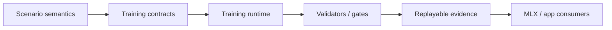
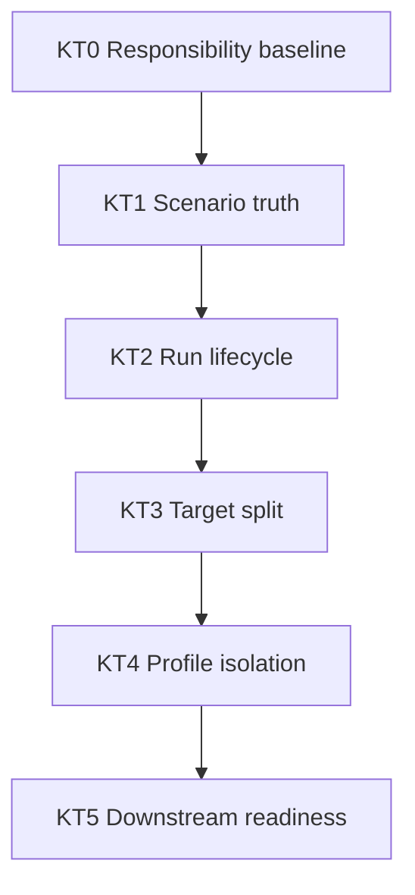
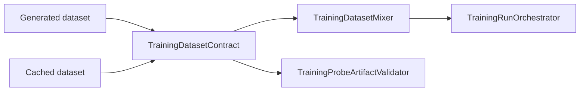

# Kuyu Training Reliability Milestones

This document defines the local reliability ladder for `kuyu-training`.
`../KUYU_CAPABILITY_ROADMAP.md` owns the cross-package capability order. This
file owns the package-local sequence that must be completed before treating
`kuyu-training` as a stable dependency for backend, app, and long-running
training work.

## End State

`kuyu-training` is reliable when it can preserve scenario truth, run and resume
training through typed contracts, reject stale artifacts, and expose stable
package targets without robot-specific shortcuts in generic layers.



## Advancement Rule

New work in `kuyu-training` should advance the first incomplete milestone unless
there is a blocking defect in an earlier milestone. A milestone is not complete
because the package builds. It is complete only when contract, implementation,
validator, regression tests, and evidence all agree.

| Requirement | Completion meaning |
|---|---|
| Contract | The typed boundary is documented and represented in public types. |
| Runtime path | Production code consumes the contract directly. |
| Fail-closed gate | Invalid, stale, partial, or ambiguous input is rejected. |
| Regression tests | Positive and negative cases cover the invariant. |
| Evidence | The verification command and artifact paths are recorded. |

## Milestones

| ID | Name | Status | Purpose | Completion gate |
|---|---|---|---|---|
| KT0 | Responsibility baseline | Complete | Keep `kuyu-training` scoped to generic training contracts and runtime infrastructure. | README boundary, root package architecture, boundary validation script, clean package status. |
| KT1 | Scenario truth preservation | Complete for current runtime paths | Preserve task reference, reward descriptor, record count, and terminal boundary semantics across generated and cached datasets. | `TrainingDatasetContractValidator` plus dataset mixer, training orchestrator, and recovery artifact validator tests. |
| KT2 | Run lifecycle reliability | Complete for current package runtime paths | Make run creation, resume, pause, cancel, failure, and artifact publication auditable and fail-closed under crash windows. | Targeted tests for torn journals, duplicate writers, terminal immutability, cancellation, secondary failure reporting, managed handles, managed executors, and artifact validation after resume. |
| KT3 | Target split and import gates | Complete for current public facade | Split the monolithic target into contract, evolution, reinforcement, runtime, and validation targets without changing behavior. | SwiftPM target split, static import-boundary gate, facade compatibility test, and package-level xcodebuild test. |
| KT4 | Profile isolation | Complete for current profile-adapter boundary | Ensure generic validators stay robot-agnostic while profile validators own robot-specific requirements. | Non-quadrotor executable contract tests, reference-quadrotor profile tests, rejection of legacy CTBR shortcut compatibility, and runtime adapter boundary gate. |
| KT5 | Downstream adoption readiness | Complete for current public-consumer paths | Give `kuyu-mlx` and app adapters stable typed entrypoints and artifact schemas that do not require internal knowledge. | Type-erased facade tests, generated artifact compatibility tests, and app/MLX smoke tests consuming only public contracts. |

## Dependency Order



The order is intentionally conservative. Target splitting before lifecycle and
artifact gates would only move unreliable behavior across more modules. Profile
expansion before the generic/profile boundary is enforced would make generic
contracts robot-shaped again.

## KT0: Responsibility Baseline

Status: complete.

Owned responsibility:

| Owned | Not owned |
|---|---|
| Dataset schemas, project packages, typed training plans, backend protocols, run contracts, artifact validators | MLX kernels, Manas checkpoint internals, SwiftUI, CLI parsing, scenario reward authority |

Acceptance evidence:

| Evidence | Required state |
|---|---|
| `README.md` | Documents responsibility boundary and reliability contract. |
| `../KUYU_PACKAGE_ARCHITECTURE.md` | Defines package and target boundaries. |
| `../scripts/validate-kuyu-boundaries.sh` | Passes. |

## KT1: Scenario Truth Preservation

Status: complete for current runtime paths and production source load gates.

Scenario truth must survive every dataset reuse boundary:



Acceptance evidence:

| Invariant | Gate |
|---|---|
| Reward descriptor changes invalidate cached data. | `TrainingDatasetContractValidator` negative tests. |
| Missing terminal facts invalidate cached data. | `TrainingDatasetMixer` and orchestrator negative tests. |
| Recovery relabel artifacts cannot carry stale datasets. | `TrainingProbeArtifactValidator` negative tests. |
| Terminal `continueValue` is zero at true episode boundaries. | Dataset contract validator tests. |
| Scenario terminal facts cannot be persisted in an inconsistent state. | `TrainingDatasetWriter` calls `ScenarioTerminalFacts.validate()` before writing dataset metadata and records. |
| New production dataset load paths cannot bypass validation. | Boundary gate rejects `TrainingDataset.load(from:)` outside `TrainingDatasetContractValidator`. |
| Cached payloads preserve tensor-safe record structure. | `TrainingDatasetContractValidator` rejects negative metadata counts, non-positive or non-finite timing, non-finite payload scalars/vectors, non-monotonic record time, and out-of-range sensor/drive/reflex indices. |
| Scenario-run replay evidence survives the training boundary. | `TrainingScenarioRunSummary.replay` preserves `ValidationSummary.replay`, legacy summaries decode as replay-not-performed, and `TrainingScenarioReplayValidator` rejects empty, missing, failed, unexpected, or duplicate replay checks. |
| Runnable starter templates resolve to scenario-owned coverage. | `RunnableStarterScenarioCoverageValidator` checks every default runnable starter primary stage against `ReferenceQuadrotorScenarioCatalog`, rejecting missing starters, unresolved suites, invalid episode counts, empty coverage, and duplicate scenario keys. |
| Training run artifacts carry replay evidence for scenario metrics. | `TrainingArtifactWriter` writes `scenario-runs.jsonl`, `TrainingRunOrchestrator` validates replay before accepting suite output, and `TrainingRunArtifactValidator` rejects completed, rejected, metric-bearing, missing, mismatched, duplicate, or replay-not-performed scenario run artifacts. |

Remaining maintenance rule: any new cache-consuming runtime path must call
`TrainingDatasetContractValidator` or a stricter package-local validator before
data is reused. Source-level direct loads are allowed in tests and in the
validator implementation only. Any new scenario-run output consumer that treats
a suite as accepted must validate `TrainingScenarioRunSummary.replay` through
`TrainingScenarioReplayValidator` or a stricter package-local gate. Any new
runnable starter template must pass `RunnableStarterScenarioCoverageValidator`
so task/profile/suite declarations cannot drift away from scenario-owned
coverage. Training run artifact consumers must load through
`TrainingRunArtifactValidator` or a stricter package-local gate so
`scenario-runs.jsonl` replay evidence cannot be bypassed.

## KT2: Run Lifecycle Reliability

Status: complete for current package runtime paths.

Goal: a training run must be inspectable and recoverable even when it is paused,
cancelled, interrupted, or fails while writing artifacts.

Required gates:

| Area | Required checks |
|---|---|
| Journal integrity | Torn tail repair, corrupted middle-line rejection, monotonic iteration enforcement. |
| Writer ownership | Duplicate live writer rejection and dead-writer resume behavior. |
| Terminal outcome | Completed, cancelled, failed, and paused states write explicit outcomes. |
| Terminal immutability | Terminal runs cannot accept new control commands, be reopened for writing, appended to, or transitioned back to non-terminal states. |
| Artifact publication | Rejected candidates never appear at accepted paths. |
| Artifact acceptance consistency | Training run artifacts cannot claim accepted convergence without an accepted/staged checkpoint decision and required checkpoint evidence. |
| Event lifecycle | Public run handles finish streams on operation completion, cancellation, and `shutdown()` so consumers do not hang. |
| Standard executor lifecycle | Package-provided executors wrap `start` and `resume` operations in managed handles instead of exposing stream ownership to training backends. |

Exit criteria:

| Criterion | Evidence |
|---|---|
| Every terminal path writes a durable outcome. | Targeted `TrainingRunContract` and orchestrator tests. |
| Terminal outcomes are final at reader and writer boundaries. | `submitControlCommandRejectsTerminalRun`, `openRefusesTerminalRun`, `writerRejectsMutationAfterTerminalOutcome`, and `writerRejectsOutcomeTransitionAfterTerminalOutcome`. |
| Published artifact acceptance is internally consistent. | `trainingRunArtifactValidatorRejectsAcceptedConvergenceWithoutAcceptedCheckpointDecision`, `trainingRunArtifactValidatorRejectsAcceptedCheckpointDecisionWithoutAcceptedConvergence`, `trainingRunArtifactValidatorRejectsAcceptedCheckpointWithoutPublishedEvidence`, `trainingRunArtifactValidatorRejectsStagedCheckpointWithoutCandidateEvidence`, and `trainingRunArtifactValidatorRejectsAcceptedCheckpointIDMismatch`. |
| Every resumable failure mode is either repaired or rejected with a typed error. | Resume/corruption tests. |
| Event streams cannot outlive a stopped run. | `ManagedTrainingRunHandle` tests for completion, cancellation, and shutdown stream termination. |
| Standard executor entry points preserve the managed lifecycle. | `ManagedTrainingRunExecutor` tests for start/resume event forwarding, start/resume validation rejection, and continuation selection. |

## KT3: Target Split and Import Gates

Status: complete for current public facade.

Goal: keep `KuyuTraining` split into smaller targets only after KT2 makes
runtime behavior trustworthy.

Current gate: `TARGET_OWNERSHIP.md` defines the physical target ownership map,
and `/Users/1amageek/Desktop/Robot/unconscious/scripts/validate-kuyu-boundaries.sh`
fails when the facade stops being re-export only, a split product/target is
missing, or a lower target imports a higher target.

Target ownership:

| Target | Owns |
|---|---|
| `KuyuTrainingContracts` | Stable project/run contracts, training plans, bundle references, IDs, tensor shapes, worker snapshots, and domain-neutral enums. |
| `KuyuEvolution` | Population, selection, mutation/crossover contracts, lineage, quality diversity archive. |
| `KuyuReinforcement` | RL backend protocols, rollout buffers, rollout health contracts, stability envelopes, vectorized batch specs, and vectorized rollout contracts. |
| `KuyuTrainingRuntime` | Orchestration, cancellation/resume, scheduling, progress/event streams, runtime tuple builders, and runtime-only compatibility extensions. |
| `KuyuTrainingValidation` | Artifact, project, template, dataset, checkpoint, convergence, task-profile, and gate validators. |
| `KuyuTraining` | Facade-only target that re-exports the split public API. |

Exit criteria:

| Criterion | Evidence |
|---|---|
| Package products expose the split targets. | `Package.swift` target graph and build output. |
| Imports follow the package architecture. | Static validation script. |
| Public API remains available through a stable facade. | `KuyuTrainingFacadeCompatibilityTests`. |

KT4 follow-up discovered during the split:

| Debt | Next milestone |
|---|---|
| Some runtime and validation files still carried broad profile-adapter ownership from the mechanical split. | Resolved for reference-quadrotor rollout/profile adapters by KT4d. |

## KT4: Profile Isolation

Status: complete for current profile-adapter boundary.

Goal: generic training contracts validate structure; profile validators validate
robot meaning.

Current focus rule: finish KT5 before expanding `kuyu-training` consumers. KT5
may build on the KT4 profile-adapter boundary, but downstream consumers must
not depend on runtime internals or profile-shaped compatibility contracts.

KT4 is split into small gates so each change raises reliability without
pretending the whole profile boundary is complete:

| Slice | Status | Completion gate |
|---|---|---|
| KT4a. Vectorized rollout quality isolation | Complete | `KuyuReinforcement` owns only `VectorizedTaskQualitySummary`; reference-quadrotor conversion lives in validation/profile code; package tests and boundary gate pass. |
| KT4b. Generic template acceptance | Complete | A valid non-quadrotor template passes generic structure validation without reference-quadrotor semantics. |
| KT4c. Legacy shortcut rejection | Complete | Old CTBR shortcut compatibility fails closed unless an explicit profile adapter owns the conversion. |
| KT4d. Runtime profile import audit | Complete | Reference-quadrotor rollout/profile adapter implementations live in validation/profile code, and the boundary gate rejects reintroduction into runtime. |

Completed slices:

| Slice | Evidence |
|---|---|
| Vectorized rollout task quality is profile-neutral in `KuyuReinforcement`; reference-quadrotor task-quality conversion lives in validation/profile code. | `VectorizedTaskQualitySummary`, `ReferenceQuadrotorTaskQualitySummary+VectorizedTaskQualitySummary`, `VectorizedTrainingContractsTests`. |
| RoArm M1 profile validation is owned by profile contracts, not reference-quadrotor defaults. | `TaskEvaluationProfileFamily`, `TaskEvaluationProfileContractValidator`, `TaskEvaluationProfileTests`, `LearningProjectTemplateTests`. |
| Legacy CTBR shortcuts fail closed unless a reference-quadrotor profile owns the template or runnable stage. | `LearningProjectTemplateValidator`, `LearningProjectTemplateCatalog`, `LearningProjectTemplateTests`. |
| Reference-quadrotor rollout, relabel, dataset, health, and automated profile pipeline adapters live under validation/profile code rather than the runtime target. | `Sources/KuyuTrainingValidation/ReferenceQuadrotorRuntime`, `TARGET_OWNERSHIP.md`, `../scripts/validate-kuyu-boundaries.sh`. |

Required gates:

| Risk | Gate |
|---|---|
| Generic validator accepts only reference-quadrotor-shaped contracts. | Non-quadrotor valid template tests. |
| Generic validator encodes action semantics as global rules. | Tests that action schema and channel semantics remain profile-owned. |
| Legacy CTBR shortcuts survive silently. | Negative tests for old shortcut compatibility. |
| Profile-specific requirements leak into runtime orchestration. | Import-boundary and validator responsibility tests. |

KT5a resolves the first runner-contract upgrade by making training/probe
orchestrators consume `TrainingScenarioRunOutput`. Existing reference-quadrotor
executors may still produce `KuyAtt1RunOutput`, but that conversion now belongs
to validation/profile adapter code and consumer compatibility adapters outside
`KuyuTrainingRuntime`.

## KT5: Downstream Adoption Readiness

Status: complete for current public-consumer paths.

Goal: downstream packages consume stable public runtime DTOs and generated
artifacts instead of knowing profile-specific scenario output types or internal
target layout.

KT5 is split into consumer-facing gates:

| Slice | Status | Completion gate |
|---|---|---|
| KT5a. Runtime scenario run output neutrality | Complete | `TrainingScenarioExecuting` and `TrainingProbeScenarioExecuting` return `TrainingScenarioRunOutput`; `KuyuTrainingRuntime` rejects `KuyAtt1RunOutput` reintroduction. |
| KT5b. Generated artifact compatibility | Complete | Public artifact loaders and writers round-trip generated training/probe/checkpoint artifacts through the facade without internal target imports. |
| KT5c. App/MLX public-consumer smoke | Complete | `kuyu` and `kuyu-mlx` smoke paths consume only public contracts and generated artifacts for training/evaluation entrypoints. |

Completed slices:

| Slice | Evidence |
|---|---|
| Runtime scenario execution contracts no longer expose `KuyAtt1RunOutput`; reference-quadrotor conversion lives in validation/profile adapter code. | `TrainingScenarioRunOutput`, `TrainingDatasetExporter+KuyAtt1`, `TrainingRunOrchestrator`, `TrainingProbeOrchestrator`, `../scripts/validate-kuyu-boundaries.sh`. |
| Generated training, probe, and checkpoint evaluation artifacts can be loaded and validated through a public compatibility verifier. | `GeneratedTrainingArtifactCompatibilityVerifier`, `GeneratedTrainingArtifactCompatibilityTests`, `TrainingScenarioRunOutput`, `TrainingRunArtifactValidator`, `TrainingProbeArtifactValidator`, `CheckpointEvaluationArtifactValidator`. |
| Current app and MLX consumers load generated training run, probe, and checkpoint evaluation artifacts through public compatibility verification rather than internal validators or file-layout knowledge. | `GeneratedTrainingArtifactCompatibilityVerifier`, `TrainingRunStore`, `KuyuCLI`, `LearningCampaignArtifactValidator`, `LearningCampaignOrchestrator`, `ReferenceQuadrotorCheckpointRegressionEvidenceResolver`, `../scripts/validate-kuyu-boundaries.sh`. |

Goal: `kuyu-mlx`, CLI, UI, and long-running training harnesses can depend on
public `kuyu-training` contracts without reading internal runtime state.

Required gates:

| Consumer | Required proof |
|---|---|
| `kuyu-mlx` | Backend implementations use typed protocols and public artifact compatibility verification. |
| CLI/UI | Commands and views consume type-erased facades and generated artifacts. |
| Long-running training | Generated run, probe, and checkpoint evaluation artifacts can be validated without ad hoc state. |

Current KT5 completion does not claim that the MLX backend is fully split, that
world-model imagination is adopted, or that long-horizon reference-quadrotor
training is solved. Those remain separate capability milestones.

## Stop Rules

Stop or defer implementation work when any of these are true:

| Stop rule | Required response |
|---|---|
| A new runtime path reuses datasets without a contract gate. | Add the gate and negative test before continuing. |
| A generic validator checks robot-specific physical meaning. | Move that check into a profile validator. |
| A target split creates a dependency cycle or exposes backend internals. | Rework ownership before adding features. |
| A terminal run state can be observed without a durable outcome. | Close the lifecycle path before downstream adoption. |
| A test only proves build success. | Add semantic positive and negative assertions. |

## Verification Commands

Use these commands when updating this package:

```bash
cd /Users/1amageek/Desktop/Robot/unconscious
./scripts/validate-kuyu-boundaries.sh
TEST_TIMEOUT_SECONDS=120 ./scripts/test.sh kuyu-training
```

For focused work, add narrower tests first, then run the package-level command
before recording milestone evidence.
