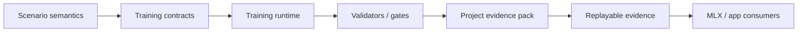
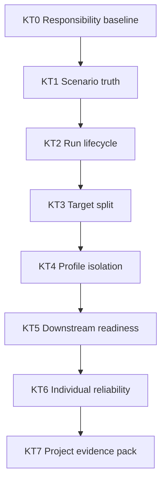
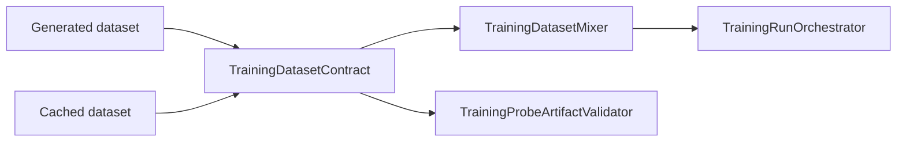
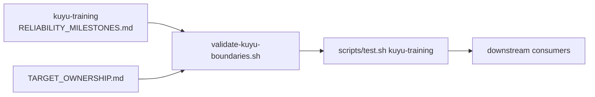

# Kuyu Training Reliability Milestones

This document defines the local reliability ladder for `kuyu-training`.
`../KUYU_CAPABILITY_ROADMAP.md` owns the cross-package capability order. This
file owns the package-local sequence that must be completed before treating
`kuyu-training` as a stable dependency for backend, app, and long-running
training work. Package-local evidence is recorded in `RELIABILITY_EVIDENCE.md`.

## End State

`kuyu-training` is reliable when it can preserve scenario truth, run and resume
training through typed contracts, reject stale artifacts, package project-level
evidence, and expose stable package targets without robot-specific shortcuts in
generic layers.



## Advancement Rule

New work in `kuyu-training` should advance the first incomplete milestone unless
there is a blocking defect in an earlier milestone. A milestone is not complete
because the package builds. It is complete only when contract, implementation,
validator, regression tests, and evidence all agree.

| Requirement | Completion meaning |
|---|---|
| Contract | The typed boundary is documented and represented in public types. |
| Runtime path | Production code consumes the contract directly. |
| Fail-closed gate | Invalid, stale, partial, or ambiguous input is rejected. |
| Regression tests | Positive and negative cases cover the invariant. |
| Evidence | The verification command and artifact paths are recorded. |

## Milestones

| ID | Name | Status | Purpose | Completion gate |
|---|---|---|---|---|
| KT0 | Responsibility baseline | Complete | Keep `kuyu-training` scoped to generic training contracts and runtime infrastructure. | README boundary, root package architecture, boundary validation script, clean package status. |
| KT1 | Scenario truth preservation | Complete for current runtime paths | Preserve task reference, reward descriptor, record count, and terminal boundary semantics across generated and cached datasets. | `TrainingDatasetContractValidator` plus dataset mixer, training orchestrator, and recovery artifact validator tests. |
| KT2 | Run lifecycle reliability | Complete for current package runtime paths, process-worker recovery, and managed/external-profile summary outcome publication | Make run creation, resume, pause, cancel, process isolation, reconnection, failure, and artifact publication auditable and fail-closed under crash windows. | Targeted tests for torn journals, duplicate writers, terminal immutability, cancellation, secondary failure reporting, managed handles, immutable process-worker launch artifacts, active lease validation, stale registration rejection, cooperative stop, reconnect, bounded diagnostics, managed and external-profile summary outcome artifacts, and artifact validation after resume. |
| KT3 | Target split and import gates | Complete for current public facade | Split the monolithic target into contract, evolution, reinforcement, runtime, and validation targets without changing behavior. | SwiftPM target split, static import-boundary gate, facade compatibility test, and package-level xcodebuild test. |
| KT4 | Profile isolation | Complete for current profile-adapter boundary | Ensure generic validators stay robot-agnostic while profile validators own robot-specific requirements. | Non-quadrotor executable contract tests, reference-quadrotor profile tests, rejection of legacy CTBR shortcut compatibility, and runtime adapter boundary gate. |
| KT5 | Downstream adoption readiness | Complete for current public-consumer paths | Give `kuyu-mlx` and app adapters stable typed entrypoints and artifact schemas that do not require internal knowledge. | Type-erased facade tests, generated artifact compatibility tests, and app/MLX smoke tests consuming only public contracts. |
| KT6 | Individual reliability baseline | Complete for current package-local baseline | Make `kuyu-training` independently auditable before additional integration work depends on it. | Root individual reliability map, README linkage, package-local evidence, static gate requirements, and package-level xcodebuild test. |
| KT7 | Project evidence pack | Complete for current generic pack artifact, split schema/evidence and validator files, reference M2 semantic stress coverage including planner-degradation scenario evidence, scenario-owned stress-manifest reloads, physics-corpus evidence, hardware measurement provenance comparison, distinct hardware report provenance comparison, joint-measured and sensor-calibrated hardware physics comparison, contact-training physics comparison, run observability projection, strict aligned observability timelines, and comparison contract | Tie dataset lineage, curriculum stages, checkpoint decisions, regression artifact references, scenario-owned stress-suite evidence, required reference M2 coverage, physics descriptor-corpus acceptance evidence, generic run observability evidence, and project-evidence comparison into one persisted package-level contract. | `TrainingProjectEvidencePack`, split evidence schema files, split validator files, `TrainingProjectEvidencePackValidator`, `TrainingProjectEvidencePackArtifactStore`, `StressSuiteManifestArtifactStore`, `TrainingProjectEvidencePackComparator`, `TrainingArtifactWriter`, and `TrainingRunArtifactValidator` positive and negative tests, decode-time path validation, referenced artifact existence checks, symlink-resolved root containment for pack/regression/stress/physics/observability files, file and directory symlink escape rejection for regression, stress-manifest, physics-corpus, and observability references, referenced stress-suite manifest owner-store reloads including Reference M2 planner-degradation ID mismatch rejection, physics corpus consistency checks, hardware measurement provenance preservation and comparison, distinct hardware report provenance comparison, joint-measured and sensor-calibrated hardware physics corpus comparison, contact-training physics corpus comparison with hardware-parity precedence, dimension-only Reference M2 rejection, run observability projection mismatch rejection, conscious/unconscious cross-stream timeline alignment rejection, repeated anchor timeline rejection, README linkage, and package-level xcodebuild test. |

## Dependency Order



The order is intentionally conservative. Target splitting before lifecycle and
artifact gates would only move unreliable behavior across more modules. Profile
expansion before the generic/profile boundary is enforced would make generic
contracts robot-shaped again.

## KT0: Responsibility Baseline

Status: complete.

Owned responsibility:

| Owned | Not owned |
|---|---|
| Dataset schemas, project packages, typed training plans, backend protocols, run contracts, artifact validators | MLX kernels, Manas checkpoint internals, SwiftUI, CLI parsing, scenario reward authority |

Acceptance evidence:

| Evidence | Required state |
|---|---|
| `README.md` | Documents responsibility boundary and reliability contract. |
| `../KUYU_PACKAGE_ARCHITECTURE.md` | Defines package and target boundaries. |
| `../scripts/validate-kuyu-boundaries.sh` | Passes. |
| Swift safety gate | Source validation rejects `try?`, `try!`, crash-only `preconditionFailure` / `fatalError`, `DispatchQueue`, `EventLoopFuture`, and `@unchecked Sendable` in package sources. |

## KT1: Scenario Truth Preservation

Status: complete for current runtime paths and production source load gates.

Scenario truth must survive every dataset reuse boundary:



Acceptance evidence:

| Invariant | Gate |
|---|---|
| Reward descriptor changes invalidate cached data. | `TrainingDatasetContractValidator` negative tests. |
| Missing terminal facts invalidate cached data. | `TrainingDatasetMixer` and orchestrator negative tests. |
| Recovery relabel artifacts cannot carry stale datasets. | `TrainingProbeArtifactValidator` negative tests. |
| Terminal `continueValue` is zero at true episode boundaries. | Dataset contract validator tests. |
| Scenario terminal facts cannot be persisted in an inconsistent state. | `TrainingDatasetWriter` calls `ScenarioTerminalFacts.validate()` before writing dataset metadata and records. |
| New production dataset load paths cannot bypass validation. | Boundary gate rejects `TrainingDataset.load(from:)` outside `TrainingDatasetContractValidator`. |
| Cached payloads preserve tensor-safe record structure. | `TrainingDatasetContractValidator` rejects negative metadata counts, non-positive or non-finite timing, non-finite payload scalars/vectors, non-monotonic record time, and out-of-range sensor/drive/reflex indices. |
| Scenario-run replay evidence survives the training boundary. | `TrainingScenarioRunSummary.replay` preserves `ValidationSummary.replay`, legacy summaries decode as replay-not-performed, and `TrainingScenarioReplayValidator` rejects empty, missing, failed, unexpected, or duplicate replay checks. |
| Runnable starter templates resolve to scenario-owned coverage. | `RunnableStarterScenarioCoverageValidator` checks every default runnable starter primary stage against `ReferenceQuadrotorScenarioCatalog`, rejecting missing starters, unresolved suites, invalid episode counts, empty coverage, and duplicate scenario keys. |
| Training run artifacts carry replay evidence for scenario metrics. | `TrainingArtifactWriter` writes `scenario-runs.jsonl`, `TrainingRunOrchestrator` validates replay before accepting suite output, and `TrainingRunArtifactValidator` rejects completed, rejected, metric-bearing, missing, mismatched, duplicate, or replay-not-performed scenario run artifacts. |
| Default runnable starters can produce validated replay artifacts. | `RunnableStarterScenarioArtifactGenerator` runs every default runnable starter primary stage through scenario-owned replay runtime, writes artifact bundles, and reloads them through `TrainingRunArtifactValidator`. |

Remaining maintenance rule: any new cache-consuming runtime path must call
`TrainingDatasetContractValidator` or a stricter package-local validator before
data is reused. Source-level direct loads are allowed in tests and in the
validator implementation only. Any new scenario-run output consumer that treats
a suite as accepted must validate `TrainingScenarioRunSummary.replay` through
`TrainingScenarioReplayValidator` or a stricter package-local gate. Any new
runnable starter template must pass `RunnableStarterScenarioCoverageValidator`
so task/profile/suite declarations cannot drift away from scenario-owned
coverage. Training run artifact consumers must load through
`TrainingRunArtifactValidator` or a stricter package-local gate so
`scenario-runs.jsonl` replay evidence cannot be bypassed. Default runnable
starter artifact evidence must be produced through
`RunnableStarterScenarioArtifactGenerator` or a stricter package-local generator
that both runs scenario replay and reloads the generated bundle through the
artifact validator.

## KT2: Run Lifecycle Reliability

Status: complete for current package runtime paths and external-profile summary outcome publication.

Goal: a training run must be inspectable and recoverable even when it is paused,
cancelled, interrupted, or fails while writing artifacts.

Required gates:

| Area | Required checks |
|---|---|
| Journal integrity | Torn tail repair, corrupted middle-line rejection, monotonic iteration enforcement. |
| Reader/resume integrity | Gap and duplicate iteration records are rejected before readers expose journal state or writers derive resume iteration. |
| Writer ownership | Duplicate live writer rejection and dead-writer resume behavior. |
| Terminal outcome | Completed, cancelled, failed, and paused states write explicit outcomes. |
| Terminal immutability | Terminal runs cannot accept new control commands, be reopened for writing, appended to, or transitioned back to non-terminal states. |
| Artifact publication | Rejected candidates never appear at accepted paths. |
| Artifact acceptance consistency | Training run artifacts cannot claim accepted convergence without an accepted/staged checkpoint decision and required checkpoint evidence. |
| Artifact lifecycle consistency | Terminal manifests must have completion time, completed runs must match accepted convergence, and rejected/skipped/failed decisions cannot expose an output checkpoint ID. |
| Durable run outcome completion | `TrainingRunDriver.finish(result:)` owns terminal-state-to-outcome mapping and accepted checkpoint path publication for public run consumers, and publishes accepted paths only from validated published checkpoint evidence. |
| Run driver reviewability | `TrainingRunDriver` keeps public state and error contracts in a small shell, with lifecycle, control polling, terminal finish mapping, checkpoint digesting, and code/run identity helpers in focused split files guarded by static line caps. |
| Terminal acceptance classification | `TrainingRunResultTerminalClassifier` owns reusable accepted/rejected/cancelled/failed/incomplete classification for public run consumers, including candidate identity, candidate URL, published URL, and manifest output checkpoint consistency for accepted outcomes. |
| Control submission policy | `TrainingRunControlSubmissionService` owns liveness validation, sequence assignment, and control command submission for public run consumers. |
| Evaluation artifact references | Evaluation records reject missing, escaping, duplicate-kind, and duplicate-path artifact references before a run journal is treated as auditable evidence. |
| Event lifecycle | Public run handles finish streams on operation completion, cancellation, and `shutdown()` so consumers do not hang. |
| Standard executor lifecycle | Package-provided executors wrap `start` and `resume` operations in managed handles instead of exposing stream ownership to training backends. |
| Durable summary outcome | Package-provided executors and external-profile handle adapters persist terminal `TrainingRunSummary` values to `training-run-summary-outcome.json`, reject non-terminal summaries before publication, and expose the saved artifact through the public compatibility verifier. |

Exit criteria:

| Criterion | Evidence |
|---|---|
| Every terminal path writes a durable outcome. | Targeted `TrainingRunContract` and orchestrator tests. |
| Terminal outcomes are final at reader and writer boundaries. | `submitControlCommandRejectsTerminalRun`, `openRefusesTerminalRun`, `writerRejectsMutationAfterTerminalOutcome`, and `writerRejectsOutcomeTransitionAfterTerminalOutcome`. |
| Published artifact acceptance is internally consistent. | `trainingRunArtifactValidatorRejectsAcceptedConvergenceWithoutAcceptedCheckpointDecision`, `trainingRunArtifactValidatorRejectsAcceptedCheckpointDecisionWithoutAcceptedConvergence`, `trainingRunArtifactValidatorRejectsAcceptedCheckpointWithoutPublishedEvidence`, `trainingRunArtifactValidatorRejectsStagedCheckpointWithoutCandidateEvidence`, and `trainingRunArtifactValidatorRejectsAcceptedCheckpointIDMismatch`. |
| Published artifact lifecycle facts are internally consistent. | `trainingRunArtifactValidatorRejectsCompletedManifestWithoutAcceptedConvergence`, `trainingRunArtifactValidatorRejectsRejectedManifestWithOutputCheckpoint`, and `trainingRunArtifactValidatorRejectsTerminalManifestWithoutCompletionTime`. |
| Durable run outcomes are completed through the run-contract owner. | `driverFinishResultPublishesAcceptedCheckpointOnlyForAcceptedCompletedRun`, `driverFinishResultDoesNotPublishAcceptedDecisionWithoutPublishedCheckpoint`, `driverFinishResultDoesNotPublishCheckpointForRejectedDecision`, `driverFinishResultDoesNotPublishCheckpointForAcceptedDecisionWithoutAcceptedConvergence`, `driverFinishResultDoesNotPublishCheckpointForRunIDMismatch`, and `driverFinishResultWritesFailureOutcomeForFailedTerminalState`. |
| Run driver responsibilities stay inspectable. | `TrainingRunDriver.swift`, `TrainingRunDriver+Lifecycle.swift`, `TrainingRunDriver+Control.swift`, `TrainingRunDriver+Finish.swift`, `TrainingRunDriver+CheckpointDigest.swift`, and `TrainingRunDriver+Identity.swift` are required and line-capped by `../scripts/validate-kuyu-boundaries.sh`. |
| Terminal acceptance is shared by live consumers and durable outcome completion. | `terminalClassifierAcceptsOnlyConsistentCompletedAcceptedRun`, `terminalClassifierRejectsAcceptedRunWithoutPublishedCheckpoint`, `TrainingRunDriver.finish(result:)`, and `learningCampaignDelegatesTerminalAcceptanceToTrainingRunClassifier`. |
| Control command submission is owned by the run-contract owner. | `controlSubmissionServiceSubmitsForLiveRun`, `controlSubmissionServiceRejectsTerminalRun`, `controlSubmissionServiceRejectsInterruptedRun`, `controlSubmissionServiceRejectsPausedRunWithDeadWriter`, and `controlCommandDelegatesSubmissionPolicyToTrainingRunService`. |
| Evaluation evidence references are unambiguous. | `readJournalValidatingEvaluationArtifactsRejectsMissingArtifacts`, `evaluationArtifactReferenceValidatorRejectsDuplicateKinds`, and `evaluationArtifactReferenceValidatorRejectsDuplicatePaths`. |
| Every resumable failure mode is either repaired or rejected with a typed error. | Resume/corruption tests. |
| Reader and resume boundaries reject corrupt iteration order. | `readerRejectsJournalGap`, `readerRejectsDuplicateJournalIteration`, and `openRejectsNonMonotonicJournalOnResume`. |
| Event streams cannot outlive a stopped run. | `ManagedTrainingRunHandle` tests for completion, cancellation, and shutdown stream termination. |
| Standard executor entry points preserve the managed lifecycle. | `ManagedTrainingRunExecutor` tests for start/resume event forwarding, start/resume validation rejection, and continuation selection. |
| Managed and external-profile summaries are durable terminal outcomes, not transient observations. | `startReturnsManagedHandleAndForwardsEvents`, `resumeReturnsManagedHandleAndForwardsEvents`, `startRejectsNonTerminalSummaryBeforeOutcomePublication`, `waitWritesSummaryOutcomeBeforeReturning`, `waitRejectsNonTerminalSummaryBeforeReturning`, `trainingRunDispatcherPublishesDurableSummaryOutcomesForProfileHandles`, `generatedArtifactCompatibilityVerifierRoundTripsSummaryOutcomeThroughFacade`, and `generatedArtifactCompatibilityVerifierRejectsNonTerminalSummaryOutcome`. |

## KT3: Target Split and Import Gates

Status: complete for current public facade.

Goal: keep `KuyuTraining` split into smaller targets only after KT2 makes
runtime behavior trustworthy.

Current gate: `TARGET_OWNERSHIP.md` defines the physical target ownership map,
and `/Users/1amageek/Desktop/Robot/unconscious/scripts/validate-kuyu-boundaries.sh`
fails when the facade stops being re-export only, a split product/target is
missing, or a lower target imports a higher target.

Target ownership:

| Target | Owns |
|---|---|
| `KuyuTrainingContracts` | Stable project/run contracts, training plans, bundle references, IDs, tensor shapes, worker snapshots, and domain-neutral enums. |
| `KuyuEvolution` | Population, selection, mutation/crossover contracts, lineage, quality diversity archive. |
| `KuyuReinforcement` | RL backend protocols, rollout buffers, rollout health contracts, stability envelopes, vectorized batch specs, and vectorized rollout contracts. |
| `KuyuTrainingRuntime` | Orchestration, cancellation/resume, scheduling, progress/event streams, runtime tuple builders, and runtime-only compatibility extensions. |
| `KuyuTrainingValidation` | Artifact, project, template, dataset, checkpoint, convergence, task-profile, and gate validators. |
| `KuyuTraining` | Facade-only target that re-exports the split public API. |

Exit criteria:

| Criterion | Evidence |
|---|---|
| Package products expose the split targets. | `Package.swift` target graph and build output. |
| Imports follow the package architecture. | Static validation script. |
| Public API remains available through a stable facade. | `KuyuTrainingFacadeCompatibilityTests`. |

KT4 follow-up discovered during the split:

| Debt | Next milestone |
|---|---|
| Some runtime and validation files still carried broad profile-adapter ownership from the mechanical split. | Resolved for reference-quadrotor rollout/profile adapters by KT4d. |

## KT4: Profile Isolation

Status: complete for current profile-adapter boundary.

Goal: generic training contracts validate structure; profile validators validate
robot meaning.

Current focus rule: finish KT5 before expanding `kuyu-training` consumers. KT5
may build on the KT4 profile-adapter boundary, but downstream consumers must
not depend on runtime internals or profile-shaped compatibility contracts.

KT4 is split into small gates so each change raises reliability without
pretending the whole profile boundary is complete:

| Slice | Status | Completion gate |
|---|---|---|
| KT4a. Vectorized rollout quality isolation | Complete | `KuyuReinforcement` owns only `VectorizedTaskQualitySummary`; reference-quadrotor conversion lives in validation/profile code; package tests and boundary gate pass. |
| KT4b. Generic template acceptance | Complete | A valid non-quadrotor template passes generic structure validation without reference-quadrotor semantics. |
| KT4c. Legacy shortcut rejection | Complete | Old CTBR shortcut compatibility fails closed unless an explicit profile adapter owns the conversion. |
| KT4d. Runtime profile import audit | Complete | Reference-quadrotor rollout/profile adapter implementations live in validation/profile code, and the boundary gate rejects reintroduction into runtime. |

Completed slices:

| Slice | Evidence |
|---|---|
| Vectorized rollout task quality is profile-neutral in `KuyuReinforcement`; reference-quadrotor task-quality conversion lives in validation/profile code. | `VectorizedTaskQualitySummary`, `ReferenceQuadrotorTaskQualitySummary+VectorizedTaskQualitySummary`, `VectorizedTrainingContractsTests`. |
| RoArm M1 profile validation is owned by profile contracts, not reference-quadrotor defaults. | `TaskEvaluationProfileFamily`, `TaskEvaluationProfileContractValidator`, `TaskEvaluationProfileTests`, `LearningProjectTemplateTests`. |
| Legacy CTBR shortcuts fail closed unless a reference-quadrotor profile owns the template or runnable stage. | `LearningProjectTemplateValidator`, `LearningProjectTemplateCatalog`, `LearningProjectTemplateTests`. |
| Learning project template validation responsibilities are split across identity/manifest, generic observation/action/policy contracts, task-profile ownership, curriculum graph rules, convergence/evaluation goals, and runtime consistency so generic validation cannot quietly reabsorb reference-quadrotor policy semantics. | `LearningProjectTemplateValidator`, `LearningProjectTemplateValidator+Identity`, `LearningProjectTemplateValidator+Contracts`, `LearningProjectTemplateValidator+Profile`, `LearningProjectTemplateValidator+Curriculum`, `LearningProjectTemplateValidator+CurriculumHelpers`, `LearningProjectTemplateValidator+Goals`, `LearningProjectTemplateValidator+Runtime`, `KuyuTrainingFacadeCompatibilityTests.learningProjectTemplateValidatorResponsibilitiesLiveInSplitFiles()`, `../scripts/validate-kuyu-boundaries.sh`. |
| Reference-quadrotor rollout harness responsibilities are split across policy factory contracts, the baseline policy factory, episode/summary schemas, runner state, execution loop, environment construction, limit checks, episode projection, and parallel collection so profile-adapter runtime evidence no longer depends on one oversized harness file. | `ReferenceQuadrotorPolicyFactory`, `KuyAtt1BaselinePolicyFactory`, `RolloutEpisode`, `RolloutSummary`, `RolloutRunner`, `RolloutRunner+Run`, `RolloutRunner+Environment`, `RolloutRunner+Limits`, `RolloutRunner+Episode`, `ParallelRolloutCollector`, `ParallelRolloutCollector+Collect`, `KuyuTrainingFacadeCompatibilityTests.referenceQuadrotorRolloutHarnessResponsibilitiesLiveInSplitFiles()`, `../scripts/validate-kuyu-boundaries.sh`. |
| Reference-quadrotor rollout, relabel, dataset, health, and automated profile pipeline adapters live under validation/profile code rather than the runtime target. | `Sources/KuyuTrainingValidation/ReferenceQuadrotorRuntime`, `TARGET_OWNERSHIP.md`, `../scripts/validate-kuyu-boundaries.sh`. |

Required gates:

| Risk | Gate |
|---|---|
| Generic validator accepts only reference-quadrotor-shaped contracts. | Non-quadrotor valid template tests. |
| Generic validator encodes action semantics as global rules. | Tests that action schema and channel semantics remain profile-owned. |
| Legacy CTBR shortcuts survive silently. | Negative tests for old shortcut compatibility. |
| Profile-specific requirements leak into runtime orchestration. | Import-boundary and validator responsibility tests. |

KT5a resolves the first runner-contract upgrade by making training/probe
orchestrators consume `TrainingScenarioRunOutput`. Existing reference-quadrotor
executors may still produce `KuyAtt1RunOutput`, but that conversion now belongs
to validation/profile adapter code and consumer compatibility adapters outside
`KuyuTrainingRuntime`.

## KT5: Downstream Adoption Readiness

Status: complete for current public-consumer paths.

Goal: downstream packages consume stable public runtime DTOs and generated
artifacts instead of knowing profile-specific scenario output types or internal
target layout.

KT5 is split into consumer-facing gates:

| Slice | Status | Completion gate |
|---|---|---|
| KT5a. Runtime scenario run output neutrality | Complete | `TrainingScenarioExecuting` and `TrainingProbeScenarioExecuting` return `TrainingScenarioRunOutput`; `KuyuTrainingRuntime` rejects `KuyAtt1RunOutput` reintroduction. |
| KT5b. Generated artifact compatibility | Complete for current public facade and split verifier reviewability | Public artifact loaders, writers, publication projections, and compatibility errors round-trip generated training/probe/checkpoint/evolution artifacts through the facade without internal target imports leaking to consumers; the verifier shell and responsibility-specific extensions remain line-capped by the boundary gate. |
| KT5c. App/MLX public-consumer smoke | Complete | `kuyu` and `kuyu-mlx` smoke paths consume only public contracts and generated artifacts for training/evaluation entrypoints. |
| KT5d. Recovery relabel report neutrality | Complete | `RecoveryRelabelReport` is the task-neutral public recovery relabel summary, with the old attitude-specific spelling kept only as a source-compatible alias. |

Completed slices:

| Slice | Evidence |
|---|---|
| Runtime scenario execution contracts no longer expose `KuyAtt1RunOutput`; reference-quadrotor conversion lives in validation/profile adapter code. | `TrainingScenarioRunOutput`, `TrainingDatasetExporter+KuyAtt1`, `TrainingRunOrchestrator`, `TrainingProbeOrchestrator`, `../scripts/validate-kuyu-boundaries.sh`. |
| Training run orchestration responsibilities are split across public contracts, dependency shell, run loop, backend training dispatch, finish/checkpoint publication, and metrics/hash support so the runtime owner can change artifact handling or training dispatch without editing one large file. | `TrainingScenarioExecuting`, `TrainingRunConfig`, `TrainingRunEvent`, `TrainingRunResult`, `TrainingRunOrchestrator`, `TrainingRunOrchestrator+Run`, `TrainingRunOrchestrator+Training`, `TrainingRunOrchestrator+Finish`, `TrainingRunOrchestrator+Metrics`, `KuyuTrainingFacadeCompatibilityTests.trainingRunOrchestratorResponsibilitiesLiveInSplitFiles()`, `../scripts/validate-kuyu-boundaries.sh`. |
| Training probe runtime responsibilities are split across explicit contracts, diagnostics, comparison, orchestration, failure, checkpoint, recovery-relabel, artifact-writing, checkpoint-publication, and scenario-adapter files so the runtime shell cannot reabsorb generated probe artifact semantics. | `TrainingProbeStage`, `TrainingProbeConfig`, `TrainingProbeManifest`, `TrainingProbeRunSummary`, `TrainingProbeRunDiagnostics`, `TrainingProbeComparison`, `TrainingProbeResult`, `TrainingProbeRecoveryRelabelStatus`, `TrainingProbeScenarioExecuting`, `TrainingProbeOrchestrator`, `TrainingProbeOrchestrator+Failure`, `TrainingProbeOrchestrator+Checkpoint`, `TrainingProbeOrchestrator+RecoveryRelabel`, `TrainingProbeArtifactWriter`, `TrainingRunConfig+CheckpointPublicationMode`, `ProbeTrainingScenarioAdapter`, `KuyuTrainingFacadeCompatibilityTests.trainingProbeRuntimeResponsibilitiesLiveInSplitFiles()`, `../scripts/validate-kuyu-boundaries.sh`. |
| Evolution run orchestration responsibilities are split across event/result contracts, run shell, generation loop, evaluation modes, finish/artifact writing, mutation schedule, failure projection, early stopping, and trace recorder files so `KuyuEvolution` remains reviewable without pulling in runtime or validation ownership. | `EvolutionRunEvent`, `EvolutionRunResult`, `EvolutionRunOrchestrator`, `EvolutionRunOrchestrator+Generations`, `EvolutionRunOrchestrator+Evaluation`, `EvolutionRunOrchestrator+Finish`, `EvolutionRunOrchestrator+MutationSchedule`, `EvolutionRunOrchestrator+FailureProjection`, `EvolutionEarlyStoppingState`, `EvolutionEvaluationTraceRecorder`, `KuyuTrainingFacadeCompatibilityTests.evolutionRunOrchestratorResponsibilitiesLiveInSplitFiles()`, `../scripts/validate-kuyu-boundaries.sh`. |
| Evolution artifact validation responsibilities are split across bundle storage, contract file checks, file loading, loaded-bundle consistency, run identity, accepted-checkpoint publication, and evaluation trace validation so public generated-artifact consumers keep one API without one oversized validator file. | `EvolutionRunArtifactBundle`, `EvolutionRunArtifactValidator`, `EvolutionRunArtifactValidator+Contract`, `EvolutionRunArtifactValidator+FileLoading`, `EvolutionRunArtifactValidator+BundleValidation`, `EvolutionRunArtifactValidator+RunIdentity`, `EvolutionRunArtifactValidator+AcceptedCheckpoint`, `EvolutionRunArtifactValidator+EvaluationTraces`, `EvolutionRunOrchestratorTests`, `GeneratedTrainingArtifactCompatibilityTests`, `../scripts/validate-kuyu-boundaries.sh`. |
| Generated artifact compatibility verifier responsibilities are split across request/report schemas, checkpoint-evaluation compatibility failure mapping, aggregate verification, validated artifact loading, project-evidence comparison and curation, evolution publication, and checkpoint-evaluation validation so the public facade does not hide all downstream adoption logic in one oversized file. | `GeneratedTrainingArtifactCompatibilityVerifier`, `GeneratedTrainingArtifactCompatibilityRequest`, `GeneratedTrainingArtifactCompatibilityReport`, `CheckpointEvaluationArtifactCompatibilityFailure`, `CheckpointEvaluationArtifactCompatibilityRequest`, `GeneratedTrainingArtifactCompatibilityVerifier+Verify`, `GeneratedTrainingArtifactCompatibilityVerifier+ArtifactLoading`, `GeneratedTrainingArtifactCompatibilityVerifier+ProjectEvidence`, `GeneratedTrainingArtifactCompatibilityVerifier+EvolutionPublication`, `GeneratedTrainingArtifactCompatibilityVerifier+CheckpointEvaluation`, `GeneratedTrainingArtifactCompatibilityTests`, `KuyuTrainingFacadeCompatibilityTests.generatedArtifactCompatibilityVerifierResponsibilitiesLiveInSplitFiles()`, `../scripts/validate-kuyu-boundaries.sh`. |
| Learning project template catalog responsibilities are split into catalog shell, domain template files, and shared builder support so validation ownership remains reviewable as more robot domains are added. | `LearningProjectTemplateCatalog`, `LearningProjectTemplate+DroneAutonomyStarter`, `LearningProjectTemplate+SinglePropLiftRecovery`, `LearningProjectTemplate+GroundRobotPointNavigation`, `LearningProjectTemplate+MultirotorBlueprints`, `LearningProjectTemplate+LeggedRobotLocomotion`, `LearningProjectTemplate+ManipulatorPickAndPlace`, `LearningProjectTemplate+RoArmM1TargetTracking`, `LearningProjectTemplate+AutomotiveLaneKeeping`, `LearningProjectTemplate+Support`, `KuyuTrainingFacadeCompatibilityTests.learningProjectTemplatesLiveInDomainSplitFiles()`, `../scripts/validate-kuyu-boundaries.sh`. |
| Autonomous pipeline contracts distinguish component world-model evidence from a learned Manas model bundle. The default aerial plan and drone starter curriculum include a world-model stage whose completion requires deterministic replay, telemetry, and artifact lineage evidence while `producesModelBundle` remains false. | `AutonomousTrainingPipelineFactory`, `AutonomousTrainingStageEvidenceKind.worldModelArtifact`, `AutonomousTrainingStageEvidenceKind.projectEvidencePack`, `LearningProjectTemplate+DroneAutonomyStarter`, `AutonomousTrainingPipelineTests.droneAutonomyPlanRequiresHardwareBoundaryGate()`, `LearningProjectTemplateTests.droneStarterTemplateDefinesMultiStageAutonomyCurriculum()`. |
| Generated training, probe, checkpoint evaluation, and evolution artifacts can be loaded, validated, and projected for publication through a public compatibility verifier. | `GeneratedTrainingArtifactCompatibilityVerifier`, `EvolutionArtifactPublicationProjection`, `GeneratedTrainingArtifactCompatibilityTests`, `TrainingScenarioRunOutput`, `TrainingRunArtifactValidator`, `TrainingProbeArtifactValidator`, `CheckpointEvaluationArtifactValidator`, `EvolutionRunArtifactValidator`; empty verification requests, mismatched run/probe artifact combinations, missing evolution artifacts, rejected evolution publication, checkpoint-evaluation validation failures, and duplicate scenario-horizon evidence fail closed through public verifier errors. |
| Current app and MLX consumers load generated training run, probe, checkpoint evaluation, and evolution artifacts through public compatibility verification rather than internal validators, internal validator errors, or file-layout knowledge. | `GeneratedTrainingArtifactCompatibilityVerifier`, `TrainingRunStore`, `KuyuCLI`, `LearningCampaignArtifactValidator`, `LearningCampaignOrchestrator`, `ReferenceQuadrotorCheckpointRegressionEvidenceResolver`, `../scripts/validate-kuyu-boundaries.sh`. |
| Generic rollout health preserves failure-reason histograms and fragment matching for downstream gates without interpreting profile-specific reason semantics. | `RolloutHealth.failureReasonCounts`, `RolloutHealth.containsFailureReason(matching:)`, `RolloutHealthTests.rolloutHealthAggregatesFailureReasonCounts`, `RolloutHealthTests.rolloutHealthMatchesFailureReasonFragments`, `../scripts/validate-kuyu-boundaries.sh`. |
| Recovery relabel summaries are public and task-neutral across attitude, lift, and single-lift relabel paths. | `RecoveryRelabelReport`, `AttitudeRecoveryRelabelReport` source-compatible alias, `TrainingProbeScenarioExecuting.writeRecoveryRelabelDataset`, `KuyuTrainingFacadeCompatibilityTests`, `../scripts/validate-kuyu-boundaries.sh`. |

Goal: `kuyu-mlx`, CLI, UI, and long-running training harnesses can depend on
public `kuyu-training` contracts without reading internal runtime state.

Required gates:

| Consumer | Required proof |
|---|---|
| `kuyu-mlx` | Backend implementations use typed protocols and public artifact compatibility verification. |
| CLI/UI | Commands and views consume type-erased facades and generated artifacts. |
| Long-running training | Generated run, probe, and checkpoint evaluation artifacts can be validated without ad hoc state. |

Current KT5 completion does not claim that the MLX backend is fully split, that
world-model imagination is adopted, or that long-horizon reference-quadrotor
training is solved. Those remain separate capability milestones.

## KT6: Individual Reliability Baseline

Status: complete for current package-local baseline.

Goal: `kuyu-training` can be evaluated as a stable dependency on its own,
without using downstream `kuyu`, `kuyu-mlx`, UI, or CLI behavior as proof of
package reliability.

KT6 connects the package-local ladder to the root individual reliability map:



Required gates:

| Area | Required checks |
|---|---|
| Root linkage | `../INDIVIDUAL_RELIABILITY_MILESTONES.md` names `kuyu-training` and its required package test command. |
| Package linkage | `README.md` and this file link the root individual reliability baseline. |
| Evidence record | `RELIABILITY_EVIDENCE.md` records the command set, evidence files, and scoped claim for KT6. |
| Ownership map | `TARGET_OWNERSHIP.md` remains the authority for target ownership and import posture. |
| Static gate | `../scripts/validate-kuyu-boundaries.sh` rejects target/import drift and direct dataset loads outside the package validator. |
| Package tests | `TEST_TIMEOUT_SECONDS=120 ../scripts/test.sh kuyu-training` passes before claiming KT6 progress. |

Exit criteria:

| Criterion | Evidence |
|---|---|
| The package has a current reliability target after KT5. | This KT6 section and milestone table. |
| Root validation requires the package-local reliability map. | `../scripts/validate-unconscious-boundaries.sh`. |
| Root validation requires the root individual reliability map to name `kuyu-training` and its test command. | `../scripts/validate-unconscious-boundaries.sh`. |
| Package-local evidence records the scoped KT6 claim. | `RELIABILITY_EVIDENCE.md` entry `2026-06-24-kt6-individual-reliability-baseline`. |
| Package source boundaries remain enforceable without downstream consumers. | `../scripts/validate-kuyu-boundaries.sh`. |
| Package tests pass through the root dispatcher. | `TEST_TIMEOUT_SECONDS=120 ../scripts/test.sh kuyu-training`. |

## KT7: Project Evidence Pack

Status: complete for current generic pack, stress-suite evidence,
physics-corpus evidence including hardware measurement provenance, distinct hardware report provenance, and sensor-calibrated hardware summaries,
conscious/unconscious observability evidence, comparison contract, public
adoption gate, and dataset-curation gate.

Goal: downstream packages should be able to consume one persisted project-level
evidence envelope instead of reassembling dataset lineage, curriculum stage
order, checkpoint publication state, regression artifact references, stress
coverage, descriptor-corpus physics acceptance, and conscious/unconscious
observability summaries locally.

`TrainingProjectEvidencePack` does not decide robot-specific quality or learned
policy success. It preserves and validates the generic contract tying already
validated artifacts together. `TrainingProjectEvidencePackArtifactStore` owns
the file name, JSON persistence, reload path, and referenced regression-artifact
existence check. Stress-suite evidence is a summary of a referenced
`StressSuiteManifest`; the store reloads that scenario-owned manifest and
requires it to match the saved pack summary before adoption.
Physics-corpus evidence is a summary of a referenced
`DescriptorCorpusAcceptanceSummary`; the store reloads that physics-owned
artifact through `DescriptorCorpusAcceptanceArtifactStore` and requires it to
match the saved pack summary before adoption.
Conscious/unconscious observability evidence is a summary of a referenced
`conscious-unconscious-observability.json`; the store reloads that artifact
through `ConsciousUnconsciousObservabilityArtifactStore`, requires the saved
summary counts to match, and fails closed when upward summaries, descending
snapshots, arbitration decisions, or latency-budget records are malformed.
`TrainingProjectEvidencePackComparator` validates both packs and compares only
generic evidence state: checkpoint state, accepted regression artifact count,
total regression artifact count, physics corpus count, physics accepted record
count, accepted hardware-parity record count, hardware evidence record count,
unique hardware measurement system count, unique hardware measurement device count,
unique hardware report hash count, hardware sensor calibration record count,
observed hardware sensor sample count, contact replay record count, reference M2 stress coverage,
observability artifact count, observability sample count, stress suite count,
stress scenario record count, dataset record count, dataset count, curriculum
stage count, and creation time.
`TrainingDatasetCurationPolicyValidator` adds a generic curation gate over raw
dataset metadata and persisted project evidence packs. When only a project pack
is available, raw-metadata-only requirements such as determinism tier or channel
count fail closed instead of being silently assumed.

Required gates:

| Area | Required checks |
|---|---|
| Dataset lineage | Dataset IDs are non-empty and unique, scenario IDs and config hashes are present, record counts are positive, and reward descriptor fields are complete when present. |
| Curriculum transitions | Stage IDs are non-empty and unique, dependencies point at existing stages, and per-stage budgets are positive. |
| Checkpoint decision | Accepted and staged checkpoint claims carry the candidate evidence they require; non-accepted decisions cannot expose a published checkpoint claim. |
| Regression artifacts | Regression artifact references are non-empty, unique, root-relative, and cannot escape via parent-directory components or symlink resolution. |
| Stress suites | Stress-suite evidence is optional but, when present, must carry unique suite IDs and root-relative paths, positive record counts, met coverage targets, valid replay evidence shape, and a referenced `StressSuiteManifest` that reloads to the same summary. Producer paths that require reference M2 readiness must call the required reference M2 coverage validator before publishing the pack, and that validator requires persisted `ReferenceM2BenchmarkEvidence` rather than dimension counts alone. |
| Physics corpora | Physics-corpus evidence is optional but, when present, must carry unique corpus IDs and root-relative paths, positive accepted record counts, non-negative hardware-parity gap counts, non-empty readiness levels, hardware evidence counts, measurement-system provenance when hardware-backed records exist, optional measurement device IDs when present, sensor calibration/sample coverage counts, contact replay coverage counts, and report hashes when hardware-backed records exist, and a referenced `DescriptorCorpusAcceptanceSummary` that reloads to the same summary. |
| Observability artifacts | Conscious/unconscious observability evidence is optional but, when present, must carry unique run IDs and root-relative paths, remain root-contained after symlink resolution, positive descending/upward/arbitration counts, non-negative latency violation counts, required upward summary channels with stable indices, and a referenced observability artifact that reloads to the same summary. |
| Decode-time validation | Persisted packs run the same validation during `Codable` decode. |
| Artifact persistence | The store writes `training-project-evidence-pack.json`, reloads it through validation, and rejects missing referenced regression artifacts by default. |
| Public verifier access | `GeneratedTrainingArtifactCompatibilityVerifier` loads project evidence packs through the same downstream-facing facade used for run, probe, evolution, and checkpoint-evaluation artifacts. |
| Generic comparison | Candidate-vs-incumbent comparison validates both packs and reports a typed decision plus dominant generic evidence factor, including hardware measurement-system/device provenance, distinct hardware report provenance, sensor-calibrated hardware physics evidence, contact-training physics evidence, hardware-parity precedence over contact-training evidence, and reference M2 coverage, without profile-specific quality interpretation. |
| Public adoption gate | Downstream consumers can ask the compatibility verifier to compare a candidate pack against an incumbent, including hardware-backed and contact-training physics evidence, and fail closed unless the candidate is preferred. |
| Dataset curation | Raw metadata and project evidence packs can be checked against a typed curation policy for minimum dataset count, total records, per-dataset records, required scenario coverage, reward descriptor evidence, and provenance evidence. |

Exit criteria:

| Criterion | Evidence |
|---|---|
| Valid project evidence packs can be built from public training metadata, curriculum, checkpoint decisions, and regression references. | `trainingProjectEvidencePackValidatorBuildsEvidencePack`. |
| Duplicate dataset lineage fails closed. | `trainingProjectEvidencePackValidatorRejectsDuplicateDatasets`. |
| Broken curriculum dependencies fail closed. | `trainingProjectEvidencePackValidatorRejectsMissingStageDependency`. |
| Accepted checkpoint publication claims cannot omit the published checkpoint evidence. | `trainingProjectEvidencePackValidatorRejectsAcceptedCheckpointWithoutPublication`. |
| Persisted packs reject absolute regression artifact paths during decode. | `trainingProjectEvidencePackDecodeRejectsAbsoluteRegressionArtifactPath`. |
| Persisted packs reload only when referenced regression artifacts exist and stay inside the artifact root after file or directory symlink resolution. | `trainingProjectEvidencePackStoreWritesAndReloadsValidatedPack`, `trainingProjectEvidencePackStoreRejectsMissingReferencedArtifact`, `trainingProjectEvidencePackStoreRejectsMissingPackFile`, `trainingProjectEvidencePackStoreRejectsRegressionArtifactSymlinkEscape`, and `trainingProjectEvidencePackStoreRejectsRegressionArtifactDirectorySymlinkEscape`. |
| Persisted packs reload stress-suite evidence only when referenced stress manifests exist, stay root-contained after symlink resolution, and match the saved summary. | `trainingProjectEvidencePackStoreWritesAndReloadsStressSuiteEvidence`, `trainingProjectEvidencePackStoreRejectsMismatchedStressSuiteEvidence`, `trainingProjectEvidencePackStoreRejectsStressSuiteSymlinkEscape`, `trainingProjectEvidencePackStoreRejectsStressSuiteDirectorySymlinkEscape`, and `trainingProjectEvidencePackValidatorRejectsUnmetStressCoverageEvidence`. |
| Required Reference M2 project evidence preserves scenario-owned case semantics, including planner-degradation scenario IDs. | `trainingProjectEvidencePackStoreWritesAndReloadsReferenceM2SemanticStressSuiteEvidence`, `trainingProjectEvidencePackStoreRejectsMismatchedReferenceM2PlannerEvidence`, `trainingProjectEvidencePackValidatorAcceptsRequiredReferenceM2StressCoverage`, and `trainingProjectEvidencePackValidatorRejectsDimensionOnlyReferenceM2StressCoverageWhenRequired`. |
| Persisted packs reload physics-corpus evidence only when referenced descriptor-corpus acceptance artifacts exist, stay inside the artifact root after file or directory symlink resolution, match the saved summary, and preserve hardware-backed corpus counts, sensor calibration/sample coverage, contact replay coverage, and report hashes. Standalone pack validation also rejects hardware-parity readiness claims without accepted hardware-parity evidence and contact-training readiness claims without contact replay evidence. | `trainingProjectEvidencePackStoreWritesAndReloadsPhysicsCorpusEvidence`, `trainingProjectEvidencePackStoreSummarizesHardwareCorpusEvidence`, `trainingProjectEvidencePackStoreSummarizesHardwareSensorCorpusEvidence`, `trainingProjectEvidencePackStoreSummarizesContactTrainingCorpusEvidence`, `trainingProjectEvidencePackStoreRejectsMismatchedPhysicsCorpusEvidence`, `trainingProjectEvidencePackStoreRejectsStaleHardwareCorpusEvidence`, `trainingProjectEvidencePackValidatorRejectsImpossibleHardwareCorpusCounts`, `trainingProjectEvidencePackValidatorRejectsHardwareParityReadinessWithoutAcceptedEvidence`, `trainingProjectEvidencePackValidatorRejectsImpossibleHardwareSensorCorpusCounts`, `trainingProjectEvidencePackValidatorRejectsImpossibleContactReplayCorpusCounts`, `trainingProjectEvidencePackValidatorRejectsContactTrainingReadinessWithoutReplayEvidence`, `trainingProjectEvidencePackStoreRejectsPhysicsCorpusSymlinkEscape`, `trainingProjectEvidencePackStoreRejectsPhysicsCorpusDirectorySymlinkEscape`, and `trainingProjectEvidencePackValidatorRejectsEscapingPhysicsCorpusPath`. |
| Persisted packs reload conscious/unconscious observability evidence only when referenced observability artifacts exist, stay inside the artifact root after file or directory symlink resolution, include required upward summary channels, and match the saved summary. | `consciousUnconsciousObservabilityArtifactValidatorAcceptsCompleteArtifact`, `consciousUnconsciousObservabilityArtifactValidatorRejectsMissingUpwardSummaryChannel`, `consciousUnconsciousObservabilityArtifactValidatorRejectsLatencyRecordWithinBudget`, `trainingProjectEvidencePackStoreWritesAndReloadsObservabilityEvidence`, `trainingProjectEvidencePackStoreRejectsMismatchedObservabilityEvidence`, `trainingProjectEvidencePackStoreRejectsObservabilitySymlinkEscape`, and `trainingProjectEvidencePackStoreRejectsObservabilityDirectorySymlinkEscape`. |
| Downstream consumers can request validated project evidence through the public compatibility verifier. | `generatedArtifactCompatibilityVerifierRoundTripsProjectEvidencePackThroughFacade` and `generatedArtifactCompatibilityVerifierRejectsInvalidProjectEvidencePack`. |
| Downstream consumers can request validated project evidence with physics-corpus references through the public compatibility verifier. | `generatedArtifactCompatibilityVerifierRoundTripsProjectEvidencePackWithPhysicsCorpusEvidence`. |
| Downstream consumers can request validated conscious/unconscious observability artifacts through the public compatibility verifier. | `generatedArtifactCompatibilityVerifierRoundTripsObservabilityArtifactThroughFacade`. |
| Downstream consumers can compare candidate and incumbent packs through a generic evidence gate. | `trainingProjectEvidencePackComparatorPrefersAcceptedCandidateOverStagedIncumbent`, `trainingProjectEvidencePackComparatorKeepsIncumbentWithMoreAcceptedRegressionEvidence`, `trainingProjectEvidencePackComparatorPrefersCandidateWithStressEvidence`, `trainingProjectEvidencePackComparatorPrefersCandidateWithPhysicsCorpusEvidence`, `trainingProjectEvidencePackComparatorPrefersHardwareBackedPhysicsCorpusEvidence`, `trainingProjectEvidencePackComparatorPrefersDistinctMeasurementDeviceProvenance`, `trainingProjectEvidencePackComparatorPrefersDistinctHardwareReportProvenance`, `trainingProjectEvidencePackComparatorPrefersSensorCalibratedHardwareCorpusEvidence`, `trainingProjectEvidencePackComparatorPrefersContactTrainingPhysicsCorpusEvidence`, `trainingProjectEvidencePackComparatorKeepsHardwareParityOverContactTrainingCorpusEvidence`, `trainingProjectEvidencePackComparatorPrefersCandidateWithObservabilityEvidence`, `trainingProjectEvidencePackComparatorReportsEquivalentEvidence`, and `trainingProjectEvidencePackComparatorRejectsInvalidCandidateBeforeScoring`. |
| Downstream consumers can perform project-evidence comparison and fail-closed adoption through the public compatibility verifier. | `generatedArtifactCompatibilityVerifierComparesProjectEvidencePacksThroughFacade`, `generatedArtifactCompatibilityVerifierPrefersHardwareBackedProjectEvidenceCandidate`, `generatedArtifactCompatibilityVerifierPrefersContactTrainingProjectEvidenceCandidate`, `generatedArtifactCompatibilityVerifierRejectsContactTrainingCandidateBelowHardwareParity`, and `generatedArtifactCompatibilityVerifierRejectsNonPreferredProjectEvidenceCandidate`. |
| Dataset curation policy gates validate raw metadata and persisted project evidence without pretending pack-only evidence can prove raw-only conditions. | `trainingDatasetCurationPolicyValidatorAcceptsRawMetadataCoverage`, `trainingDatasetCurationPolicyValidatorRejectsMissingScenarioCoverage`, `trainingDatasetCurationPolicyValidatorRejectsRawMetadataRequirementForProjectEvidencePack`, and `trainingDatasetCurationPolicyValidatorAcceptsProjectEvidencePackCoverage`. |
| Downstream consumers can apply dataset curation policy gates through the public compatibility verifier. | `generatedArtifactCompatibilityVerifierValidatesProjectEvidenceDatasetCuration` and `generatedArtifactCompatibilityVerifierRejectsProjectEvidenceDatasetCurationFailure`. |

## Stop Rules

Stop or defer implementation work when any of these are true:

| Stop rule | Required response |
|---|---|
| A new runtime path reuses datasets without a contract gate. | Add the gate and negative test before continuing. |
| A generic validator checks robot-specific physical meaning. | Move that check into a profile validator. |
| A target split creates a dependency cycle or exposes backend internals. | Rework ownership before adding features. |
| A terminal run state can be observed without a durable outcome. | Close the lifecycle path before downstream adoption; managed executor paths must write through `TrainingRunSummaryOutcomeArtifactStore` and future public summary producers must use an equivalent durable terminal artifact. |
| A test only proves build success. | Add semantic positive and negative assertions. |

## Verification Commands

Use these commands when updating this package:

```bash
cd /Users/1amageek/Desktop/Robot/unconscious
./scripts/validate-kuyu-boundaries.sh
TEST_TIMEOUT_SECONDS=120 ./scripts/test.sh kuyu-training
```

For focused work, add narrower tests first, then run the package-level command
before recording milestone evidence.
