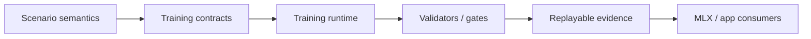
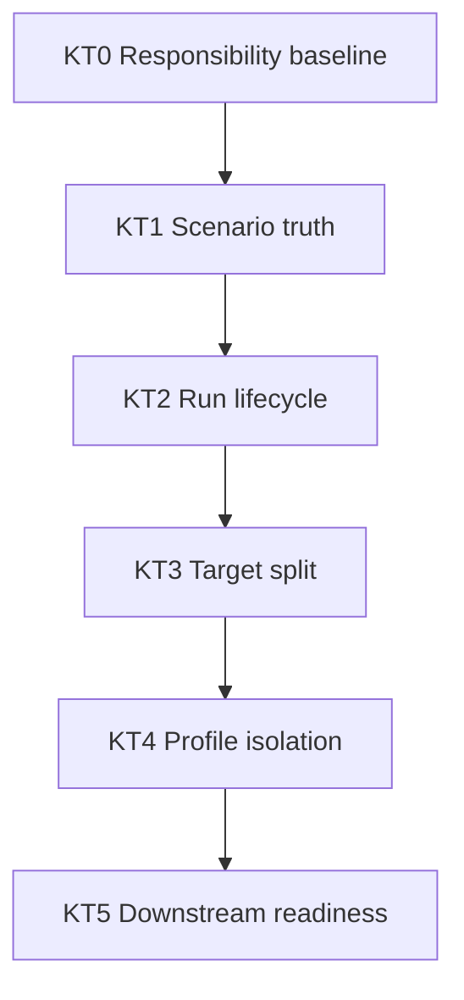
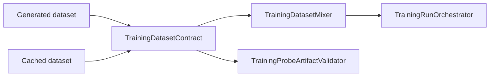

# Kuyu Training Reliability Milestones

This document defines the local reliability ladder for `kuyu-training`.
`../KUYU_CAPABILITY_ROADMAP.md` owns the cross-package capability order. This
file owns the package-local sequence that must be completed before treating
`kuyu-training` as a stable dependency for backend, app, and long-running
training work.

## End State

`kuyu-training` is reliable when it can preserve scenario truth, run and resume
training through typed contracts, reject stale artifacts, and expose stable
package targets without robot-specific shortcuts in generic layers.



## Advancement Rule

New work in `kuyu-training` should advance the first incomplete milestone unless
there is a blocking defect in an earlier milestone. A milestone is not complete
because the package builds. It is complete only when contract, implementation,
validator, regression tests, and evidence all agree.

| Requirement | Completion meaning |
|---|---|
| Contract | The typed boundary is documented and represented in public types. |
| Runtime path | Production code consumes the contract directly. |
| Fail-closed gate | Invalid, stale, partial, or ambiguous input is rejected. |
| Regression tests | Positive and negative cases cover the invariant. |
| Evidence | The verification command and artifact paths are recorded. |

## Milestones

| ID | Name | Status | Purpose | Completion gate |
|---|---|---|---|---|
| KT0 | Responsibility baseline | Complete | Keep `kuyu-training` scoped to generic training contracts and runtime infrastructure. | README boundary, root package architecture, boundary validation script, clean package status. |
| KT1 | Scenario truth preservation | Complete for current runtime paths | Preserve task reference, reward descriptor, record count, and terminal boundary semantics across generated and cached datasets. | `TrainingDatasetContractValidator` plus dataset mixer, training orchestrator, and recovery artifact validator tests. |
| KT2 | Run lifecycle reliability | In progress | Make run creation, resume, pause, cancel, failure, and artifact publication auditable and fail-closed under crash windows. | Targeted tests for torn journals, duplicate writers, terminal immutability, cancellation, secondary failure reporting, and artifact validation after resume. |
| KT3 | Target split and import gates | Pending | Split the monolithic target into contract, evolution, reinforcement, runtime, and validation targets without changing behavior. | SwiftPM target split, import-boundary tests, and no dependency cycle from validators/runtime back into backend-specific code. |
| KT4 | Profile isolation | Pending | Ensure generic validators stay robot-agnostic while profile validators own robot-specific requirements. | Non-quadrotor executable contract tests, reference-quadrotor profile tests, and rejection of legacy CTBR shortcut compatibility. |
| KT5 | Downstream adoption readiness | Pending | Give `kuyu-mlx` and app adapters stable typed entrypoints and artifact schemas that do not require internal knowledge. | Type-erased facade tests, generated artifact compatibility tests, and app/MLX smoke tests consuming only public contracts. |

## Dependency Order



The order is intentionally conservative. Target splitting before lifecycle and
artifact gates would only move unreliable behavior across more modules. Profile
expansion before the generic/profile boundary is enforced would make generic
contracts robot-shaped again.

## KT0: Responsibility Baseline

Status: complete.

Owned responsibility:

| Owned | Not owned |
|---|---|
| Dataset schemas, project packages, typed training plans, backend protocols, run contracts, artifact validators | MLX kernels, Manas checkpoint internals, SwiftUI, CLI parsing, scenario reward authority |

Acceptance evidence:

| Evidence | Required state |
|---|---|
| `README.md` | Documents responsibility boundary and reliability contract. |
| `../KUYU_PACKAGE_ARCHITECTURE.md` | Defines package and target boundaries. |
| `../scripts/validate-kuyu-boundaries.sh` | Passes. |

## KT1: Scenario Truth Preservation

Status: complete for current runtime paths.

Scenario truth must survive every dataset reuse boundary:



Acceptance evidence:

| Invariant | Gate |
|---|---|
| Reward descriptor changes invalidate cached data. | `TrainingDatasetContractValidator` negative tests. |
| Missing terminal facts invalidate cached data. | `TrainingDatasetMixer` and orchestrator negative tests. |
| Recovery relabel artifacts cannot carry stale datasets. | `TrainingProbeArtifactValidator` negative tests. |
| Terminal `continueValue` is zero at true episode boundaries. | Dataset contract validator tests. |

Remaining maintenance rule: any new cache-consuming runtime path must call
`TrainingDatasetContractValidator` or a stricter package-local validator before
data is reused.

## KT2: Run Lifecycle Reliability

Status: in progress.

Goal: a training run must be inspectable and recoverable even when it is paused,
cancelled, interrupted, or fails while writing artifacts.

Required gates:

| Area | Required checks |
|---|---|
| Journal integrity | Torn tail repair, corrupted middle-line rejection, monotonic iteration enforcement. |
| Writer ownership | Duplicate live writer rejection and dead-writer resume behavior. |
| Terminal outcome | Completed, cancelled, failed, and paused states write explicit outcomes. |
| Terminal immutability | Terminal runs cannot be reopened for writing, appended to, or transitioned back to non-terminal states. |
| Artifact publication | Rejected candidates never appear at accepted paths. |
| Event lifecycle | Public run handles finish streams through `shutdown()` and do not hang consumers. |

Exit criteria:

| Criterion | Evidence |
|---|---|
| Every terminal path writes a durable outcome. | Targeted `TrainingRunContract` and orchestrator tests. |
| Terminal outcomes are final at the writer boundary. | `openRefusesTerminalRun`, `writerRejectsMutationAfterTerminalOutcome`, and `writerRejectsOutcomeTransitionAfterTerminalOutcome`. |
| Every resumable failure mode is either repaired or rejected with a typed error. | Resume/corruption tests. |
| Event streams cannot outlive a stopped run. | Handle lifecycle tests. |

## KT3: Target Split and Import Gates

Status: pending.

Goal: split `KuyuTraining` into smaller targets only after KT2 makes runtime
behavior trustworthy.

Target ownership:

| Target | Owns |
|---|---|
| `KuyuTrainingContracts` | Plans, profiles, bundle references, dataset and artifact schemas. |
| `KuyuEvolution` | Population, selection, mutation/crossover contracts, lineage, quality diversity archive. |
| `KuyuReinforcement` | RL backend protocols, rollout buffers, fine-tuning contracts. |
| `KuyuTrainingRuntime` | Orchestration, cancellation/resume, scheduling, progress/event streams. |
| `KuyuTrainingValidation` | Artifact, project, template, dataset, and gate validators. |

Exit criteria:

| Criterion | Evidence |
|---|---|
| Package products expose the split targets. | `Package.swift` target graph and build output. |
| Imports follow the package architecture. | Import-boundary tests or static validation script. |
| Public API remains available through a stable facade. | Compatibility tests for app/MLX entrypoints. |

## KT4: Profile Isolation

Status: pending.

Goal: generic training contracts validate structure; profile validators validate
robot meaning.

Required gates:

| Risk | Gate |
|---|---|
| Generic validator accepts only reference-quadrotor-shaped contracts. | Non-quadrotor valid template tests. |
| Generic validator encodes action semantics as global rules. | Tests that action schema and channel semantics remain profile-owned. |
| Legacy CTBR shortcuts survive silently. | Negative tests for old shortcut compatibility. |
| Profile-specific requirements leak into runtime orchestration. | Import-boundary and validator responsibility tests. |

## KT5: Downstream Adoption Readiness

Status: pending.

Goal: `kuyu-mlx`, CLI, UI, and long-running training harnesses can depend on
public `kuyu-training` contracts without reading internal runtime state.

Required gates:

| Consumer | Required proof |
|---|---|
| `kuyu-mlx` | Backend implementations use typed protocols and artifact validators. |
| CLI/UI | Commands and views consume type-erased facades and generated artifacts. |
| Long-running training | Generated run artifacts can be validated and resumed without ad hoc state. |

## Stop Rules

Stop or defer implementation work when any of these are true:

| Stop rule | Required response |
|---|---|
| A new runtime path reuses datasets without a contract gate. | Add the gate and negative test before continuing. |
| A generic validator checks robot-specific physical meaning. | Move that check into a profile validator. |
| A target split creates a dependency cycle or exposes backend internals. | Rework ownership before adding features. |
| A terminal run state can be observed without a durable outcome. | Close the lifecycle path before downstream adoption. |
| A test only proves build success. | Add semantic positive and negative assertions. |

## Verification Commands

Use these commands when updating this package:

```bash
cd /Users/1amageek/Desktop/Robot/unconscious
./scripts/validate-kuyu-boundaries.sh
TEST_TIMEOUT_SECONDS=120 ./scripts/test.sh kuyu-training
```

For focused work, add narrower tests first, then run the package-level command
before recording milestone evidence.
