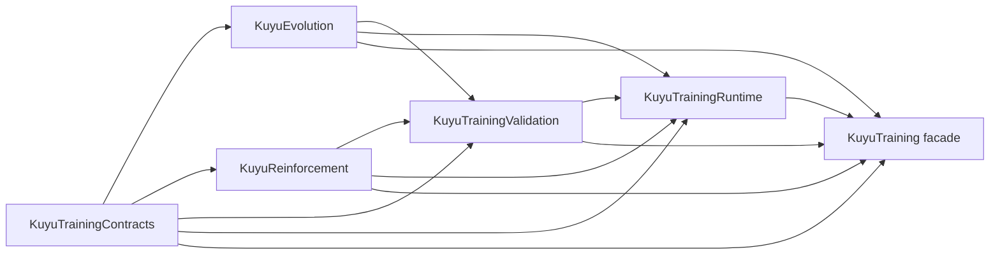

# Kuyu Training Target Ownership

This file defines the physical SwiftPM target ownership for `kuyu-training`.
`KuyuTraining` is now a facade target; implementation must live in one of the
smaller targets below.

## Target Graph

The graph is intentionally one-way. `KuyuTrainingContracts` must remain the
lowest target. `KuyuEvolution` and `KuyuReinforcement` may consume contracts but
must not consume runtime or validation. `KuyuTrainingValidation` may consume
contracts and backend-domain DTOs. `KuyuTrainingRuntime` composes the lower
targets into executable run, rollout, probe, resume, and artifact workflows.

## Ownership

| Target | Owns | Import posture |
|---|---|---|
| `KuyuTrainingContracts` | Stable project/run contracts, task/curriculum plans, capability and safety-gate enums, model/checkpoint references, run requests, run summaries, tensor shapes, worker snapshots, facade protocol DTOs, and Kuyu dataset v7 schemas. | May import Foundation. Must not import Kuyu runtime/domain targets, physics, scenarios, MLX, or Manas internals. |
| `KuyuEvolution` | Candidate evaluation, population seed requests, reproduction requests, typed evolution backend adapters, selection, mutation, resume state, lineage, artifacts, quality diversity, and evolution run orchestration. | May import `KuyuTrainingContracts`. Must not import validation, runtime, physics, scenarios, MLX, or Manas internals. |
| `KuyuReinforcement` | Reinforcement backend protocols, rollout buffers, rollout health contracts, stability envelopes, vectorized batch specs, vectorized rollout contracts, and vectorized collectors. | May import `KuyuTrainingContracts`. Must not import validation, runtime, physics, scenarios, MLX, or Manas internals. Profile-specific rollout quality must enter through validation/profile adapters. |
| `KuyuTrainingValidation` | Kuyu dataset v7 validation sessions, bounded streaming readers, durable writers, legacy source verification/migration diagnostics, scenario run output DTOs, project/package/template validation, artifact validation, checkpoint gates, convergence gates, task profiles, action codecs, relabelers, profile-specific validators, and profile-owned rollout/data adapters. | May import contracts, evolution, reinforcement, KuyuCore, KuyuPhysics, and KuyuScenarios as needed to validate artifacts. Must not import runtime, MLX, or Manas internals. |
| `KuyuTrainingRuntime` | Managed run handles, standard executors, archive contracts, training/probe orchestration, immutable standalone/app/executable-bundle staging, backend-specific source/staged bundle preflight injection, runtime tuple builders, generated artifact compatibility facades, and runtime-only compatibility extensions. | May import contracts, evolution, reinforcement, validation, KuyuCore, KuyuPhysics, and KuyuScenarios. Must not import MLX, Mojo, or Manas internals, and must not own profile adapter implementations. |
| `KuyuTraining` | Facade-only re-export target. | Must contain only re-exports of the split targets. No implementation belongs here. |

## Gate

`/Users/1amageek/Desktop/Robot/unconscious/scripts/validate-kuyu-boundaries.sh`
enforces the target graph:

| Gate | Failure condition |
|---|---|
| Target presence | `Package.swift` does not expose all split products and targets. |
| Facade-only target | `Sources/KuyuTraining` contains implementation files or misses a split target re-export. |
| Contract imports | `KuyuTrainingContracts` imports any higher target, physics, scenarios, MLX, or Manas internals. |
| Evolution imports | `KuyuEvolution` imports validation, runtime, physics, scenarios, MLX, or Manas internals. |
| Reinforcement imports | `KuyuReinforcement` imports validation, runtime, physics, scenarios, MLX, or Manas internals. |
| Validation imports | `KuyuTrainingValidation` imports runtime, MLX, or Manas internals. |
| Runtime imports | `KuyuTrainingRuntime` imports MLX or Manas internals. |
| Runtime profile adapters | `KuyuTrainingRuntime` defines reference-quadrotor rollout policy factories, rollout collectors, environment adapters, or relabel adapters instead of keeping them in validation/profile code. |

## Migration Rule

New code must enter the target that owns its runtime responsibility. If a new
type appears to need a higher target from a lower one, extract the shared DTO to
`KuyuTrainingContracts` only when it is stable and domain-neutral. Otherwise,
move the feature up to `KuyuTrainingRuntime` or `KuyuTrainingValidation`.

KT4 owns the remaining profile-isolation work: generic contracts must keep
profile-specific metrics behind neutral DTOs, while validation/profile adapters
own conversion into robot-specific meaning. Profile-specific runtime adapters
belong under `KuyuTrainingValidation` until KT5 replaces the current
profile-shaped runner contracts with profile-neutral runtime DTOs.
